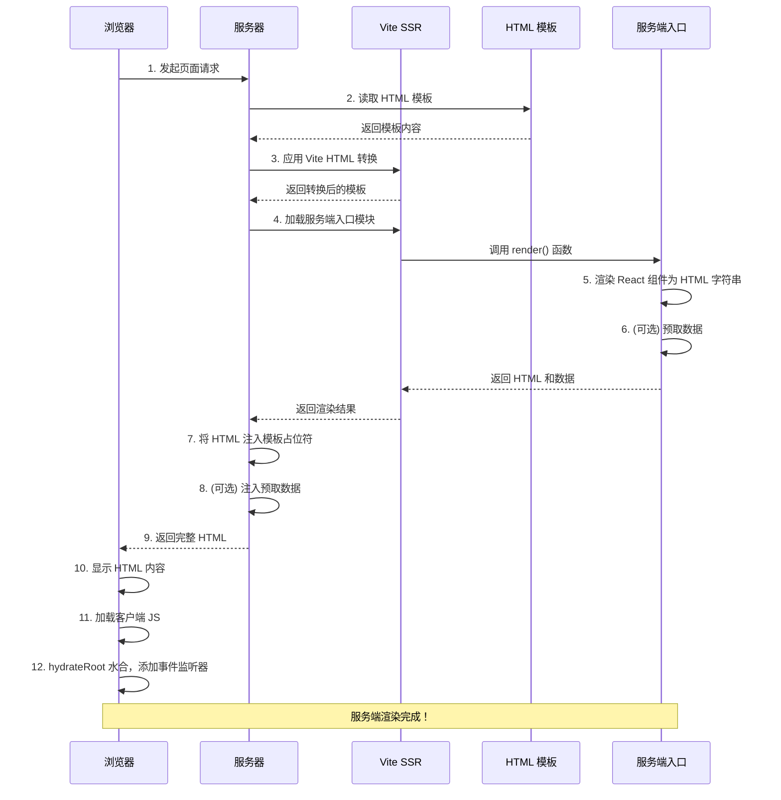
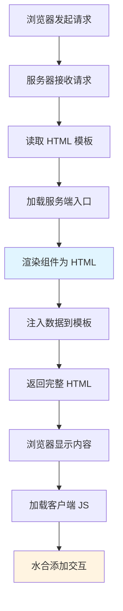

# 4. SSR 入门

***

## 文档概述

本文档专注于 Vite 对 SSR（服务端渲染）的支持，以及如何搭建一个简单的 SSR 项目。

**学习目标：**

- 了解什么是 SSR 以及与 CSR 的区别
- 理解 Vite 对 SSR 的支持
- 掌握 SSR 的前置知识和关键概念
- 实操搭建一个简单的 SSR 项目
- 掌握 SSR 的基本配置和使用

***

## 一、SSR 简介

### 1.1 什么是 SSR

**SSR（Server-Side Rendering，服务端渲染）** 是一种在服务端将组件渲染成 HTML 字符串，然后发送给浏览器的技术。

**传统 CSR（Client-Side Rendering，客户端渲染）：**

- 浏览器加载一个空的 HTML
- 下载 JavaScript
- JavaScript 在浏览器中执行
- 渲染组件并显示内容

**SSR（服务端渲染）：**

- 浏览器请求页面
- 服务端在服务器上渲染组件为 HTML
- 发送完整的 HTML 给浏览器
- 浏览器直接显示 HTML，然后 JavaScript 接管（hydration）

### 1.2 SSR vs CSR 对比

| 对比项         | CSR（客户端渲染）      | SSR（服务端渲染）        |
| ----------- | --------------- | ----------------- |
| **首屏加载速度**  | 较慢（需要等待 JS 加载）  | 较快（直接显示 HTML）     |
| **SEO 友好度** | 较差（搜索引擎需要执行 JS） | 较好（搜索引擎直接抓取 HTML） |
| **服务端压力**   | 较小（大部分工作在客户端）   | 较大（每次请求都要渲染）      |
| **开发复杂度**   | 较低              | 较高                |
| **适用场景**    | 后台管理、B端应用       | 内容展示、C端应用         |

### 1.3 SSR 的优势

**1. 更好的首屏加载性能**

用户可以更快看到页面内容，不需要等待所有 JavaScript 加载完成。

**2. 更好的 SEO**

搜索引擎可以直接抓取完整的 HTML 内容，不需要执行 JavaScript。

**3. 更好的用户体验**

对于慢网络环境或低性能设备，SSR 可以提供更好的体验。

### 1.4 SSR 的挑战

**1. 开发复杂度增加**

需要处理服务端和客户端的差异，例如：

- 服务端没有 `window`、`document` 等浏览器 API
- 需要处理数据预取
- 需要处理 hydration（水合）

**2. 服务端压力**

每个请求都需要在服务端渲染，增加了服务器负担。

**3. 部署复杂**

需要部署 Node.js 服务端，而不是只部署静态文件。

***

## 二、Vite 对 SSR 的支持

### 2.1 Vite SSR 的特点

Vite 提供了内置的 SSR 支持，具有以下特点：

- **无需额外配置** - Vite 内置支持 SSR
- **开发体验好** - 支持 HMR（热模块替换）
- **构建优化** - 自动优化 SSR 构建
- **灵活的架构** - 支持各种框架

### 2.2 Vite SSR 的工作原理

**开发环境：**

1. Vite 开发服务器同时处理客户端和服务端代码
2. 服务端代码使用 Vite 的 SSR 转换
3. 支持热模块替换（HMR）

**生产环境：**

1. 分别构建客户端和服务端代码
2. 服务端代码用于预渲染 HTML
3. 客户端代码用于 hydration

***

## 三、前置知识

在开始创建入口文件之前，先了解几个关键的概念和 API：

### 3.1 `vite.transformIndexHtml()` - Vite HTML 转换

**作用**：在开发环境中处理 `index.html`，注入 Vite 开发工具所需的脚本。

**为什么需要它？**

在 SSR 开发环境中，Vite 需要：

1. 注入热更新（HMR）客户端脚本
2. 处理模块预加载
3. 处理 CSS 引用
4. 确保客户端能连接到 Vite 开发服务器

**用法**：

```javascript
// server.js 中
template = await vite.transformIndexHtml(url, template)
```

**转换前后对比**：

**转换前：**

```html
<!DOCTYPE html>
<html>
  <head>
    <title>Vite SSR</title>
  </head>
  <body>
    <div id="root"></div>
    <script type="module" src="/src/entry-client.tsx"></script>
  </body>
</html>
```

**转换后（开发环境）：**

```html
<!DOCTYPE html>
<html>
  <head>
    <title>Vite SSR</title>
    <!-- Vite 注入：热更新客户端 -->
    <script type="module" src="/@vite/client"></script>
    <!-- Vite 注入：CSS 热更新 -->
    <link rel="stylesheet" href="/src/index.css">
  </head>
  <body>
    <div id="root"></div>
    <script type="module" src="/src/entry-client.tsx"></script>
  </body>
</html>
```

**生产环境注意**：

- 生产构建时，`vite build` 会预先生成最终的 HTML
- 不需要在运行时调用 `transformIndexHtml`

---

### 3.2 `hydrateRoot` vs `createRoot`

#### `createRoot` - 客户端渲染

**作用**：用于纯客户端渲染（CSR），会清空容器并重新渲染所有内容。

**用法**：

```typescript
import { createRoot } from 'react-dom/client'

const container = document.getElementById('root')!
const root = createRoot(container)
root.render(<App />)
```

**适用场景**：

- 纯客户端应用（没有服务端渲染）
- 传统的 SPA（单页应用）
- 页面初始没有任何 HTML 内容

**特点**：

- 清空容器内的现有内容
- 完全重新创建 DOM 树
- 性能稍差（因为需要重新创建所有节点）

---

#### `hydrateRoot` - 服务端渲染的客户端水合

**作用**：用于 SSR 的客户端水合（hydration），复用服务端已渲染的 HTML，只添加事件监听器。

**用法**：

```typescript
import { hydrateRoot } from 'react-dom/client'

const container = document.getElementById('root')!
hydrateRoot(container, <App />)
```

**适用场景**：

- SSR（服务端渲染）应用
- SSG（静态站点生成）应用
- 页面初始已有服务端渲染的 HTML

**特点**：

- 复用现有的 HTML DOM
- 只添加事件监听器，不重新创建节点
- 性能更好（避免重复渲染）
- 需要确保客户端和服务端渲染的内容一致

---

#### 对比总结

| 特性           | createRoot | hydrateRoot |
| ------------ | ---------- | ----------- |
| **用途**       | 纯客户端渲染     | SSR/SSG 水合  |
| **清空容器**     | ✅ 是        | ❌ 否         |
| **复用 DOM**   | ❌ 否        | ✅ 是         |
| **性能**       | 较慢         | 较快          |
| **React 版本** | 18+        | 18+         |

---

### 3.3 模板文件（index.html）

**1. 模板文件的位置**

`index.html` 放在服务端项目的根目录，但被服务端和客户端共享使用：

```
my-ssr-app/
├── index.html          ← 模板在这里，双方共用
├── server.js
├── src/
│   ├── entry-client.tsx
│   └── entry-server.tsx
```

**为什么都在服务端目录？**
- 服务端：需要读取它来注入 SSR 渲染的 HTML
- 客户端：浏览器最终加载的也是这个文件（被 Vite 转换后）
- 开发时：Vite 开发服务器统一管理这个文件

---

**2. 服务端如何知道加载哪个模板？**

**简单情况（单页应用）：**
所有路由都使用同一个 `index.html`：

```javascript
// server.js
app.use('*', async (req, res) => {
  // 所有请求都读取同一个模板
  let template = fs.readFileSync(
    path.resolve(__dirname, 'index.html'),
    'utf-8'
  )
  // ...
})
```

**复杂情况（多页应用）：**
根据 URL 路由选择不同模板：

```javascript
// server.js
app.use('*', async (req, res) => {
  const url = req.originalUrl
  let templatePath
  
  // 根据 URL 选择模板
  if (url.startsWith('/about')) {
    templatePath = path.resolve(__dirname, 'about.html')
  } else if (url.startsWith('/admin')) {
    templatePath = path.resolve(__dirname, 'admin.html')
  } else {
    templatePath = path.resolve(__dirname, 'index.html')
  }
  
  let template = fs.readFileSync(templatePath, 'utf-8')
  // ...
})
```

---

**3. 模板需要显示哪些信息？**

**基本信息（必须）：**
```html
<!DOCTYPE html>
<html>
  <head>
    <meta charset="UTF-8">
    <title><!--page-title--></title>
    <meta name="description" content="<!--meta-description-->">
  </head>
  <body>
    <!-- 占位符：服务端会把渲染的 HTML 注入这里 -->
    <div id="root"><!--ssr-outlet--></div>
    
    <!-- 占位符：注入预取数据 -->
    <!--ssr-data-->
    
    <!-- 客户端入口 -->
    <script type="module" src="/src/entry-client.tsx"></script>
  </body>
</html>
```

**常见占位符说明：**
| 占位符 | 用途 | 示例 |
|-------|------|------|
| `<!--ssr-outlet-->` | 注入 SSR 渲染的组件 HTML | `<div>React 组件内容</div>` |
| `<!--ssr-data-->` | 注入预取的数据 | `<script>window.__SSR_DATA__ = {...}</script>` |
| `<!--page-title-->` | 动态页面标题（SEO） | `<title>我的文章</title>` |
| `<!--meta-description-->` | 动态 meta 描述（SEO） | `<meta name="description" content="...">` |

---

**4. 完整示例：动态模板注入**

```javascript
// server.js 改进版
app.use('*', async (req, res) => {
  const url = req.originalUrl
  
  try {
    // 1. 读取模板
    let template = fs.readFileSync(
      path.resolve(__dirname, 'index.html'),
      'utf-8'
    )
    
    // 2. 应用 Vite 转换
    template = await vite.transformIndexHtml(url, template)
    
    // 3. 加载服务端入口并渲染
    const { render } = await vite.ssrLoadModule('/src/entry-server.tsx')
    const { html: appHtml, data } = await render(url)
    
    // 4. 动态注入各种信息
    template = template
      .replace('<!--ssr-outlet-->', appHtml)
      .replace('<!--page-title-->', data.title)
      .replace('<!--meta-description-->', data.description)
      .replace(
        '<!--ssr-data-->', 
        `<script>window.__SSR_DATA__ = ${JSON.stringify(data)}</script>`
      )
    
    // 5. 返回完整 HTML
    res.status(200).set({ 'Content-Type': 'text/html' }).end(template)
  } catch (e) {
    vite.ssrFixStacktrace(e)
    console.error(e)
    res.status(500).end(e.message)
  }
})
```

---

### 3.4 SSR 中的前后端路由工作方式

**核心问题**：前端有路由，但服务端也需要根据同一个 URL 渲染对应的组件！

---

**1. 理解：服务端和客户端需要"共识"**

```
浏览器访问：/about
    ↓
服务端接收请求，看到 URL 是 /about
    ↓
服务端也用同样的路由逻辑，找到 About 组件
    ↓
服务端渲染 About 组件为 HTML
    ↓
返回给浏览器，客户端再接管路由
```

---

**2. 方案：路由配置共享（推荐）**

把路由配置抽离成单独文件，服务端和客户端都用它！

```
src/
├── routes.ts        ← 路由配置，双方共用！
├── App.tsx
├── entry-client.tsx
└── entry-server.tsx
```

---

**3. 具体实现**

**第 1 步：创建共享的路由配置** `src/routes.ts`

```typescript
// src/routes.ts - 路由配置，服务端和客户端都用
import Home from './pages/Home'
import About from './pages/About'
import Article from './pages/Article'

export const routes = [
  {
    path: '/',
    component: Home,
    exact: true,
    title: '首页'
  },
  {
    path: '/about',
    component: About,
    exact: true,
    title: '关于我们'
  },
  {
    path: '/article/:id',
    component: Article,
    exact: true,
    title: '文章详情'
  }
]

// 根据 URL 找到对应的路由
export function matchRoute(url: string) {
  const pathname = url.split('?')[0]
  for (const route of routes) {
    if (pathname === route.path) {
      return route
    }
    // 处理动态路由如 /article/:id
    if (route.path.includes(':')) {很多动态路由，，，
      const pattern = new RegExp('^' + route.path.replace(/:[\w]+/g, '([\\w-]+)') + '$')
      const match = pathname.match(pattern)
      if (match) {
        return { ...route, params: match.slice(1) }
      }
    }
  }
  return null
}
```

**第 2 步：服务端入口使用路由** `src/entry-server.tsx`

```typescript
// src/entry-server.tsx
import React from 'react'
import { renderToString } from 'react-dom/server'
import { routes, matchRoute } from './routes'

export async function render(url: string) {
  // ┌─────────────────────────────────────────────┐
  // │ 🔑 这里！根据 URL 找到对应的组件          │
  // └─────────────────────────────────────────────┘
  const matchedRoute = matchRoute(url)
  if (!matchedRoute) {
    return { html: '<div>404 Not Found</div>', data: {}, title: '404' }
  }

  // 如果组件有数据预取方法，先调用
  let pageData = {}
  const Component = matchedRoute.component
  if ((Component as any).getInitialProps) {
    pageData = await (Component as any).getInitialProps({
      url,
      params: matchedRoute.params
    })
  }

  // 渲染对应组件
  const html = renderToString(
    <React.StrictMode>
      <Component {...pageData} />
    </React.StrictMode>
  )

  return { 
    html, 
    data: pageData,
    title: matchedRoute.title || 'Vite SSR'
  }
}
```

**第 3 步：页面组件支持数据预取** `src/pages/Article.tsx`

```typescript
// src/pages/Article.tsx
import { useState, useEffect } from 'react'

interface ArticleProps {
  id?: string
  title?: string
  content?: string
}

function Article({ id, title, content }: ArticleProps) {
  const [article, setArticle] = useState({ title, content })

  // 客户端如果没有数据，重新获取
  useEffect(() => {
    if (!title && id) {
      fetch(`/api/article/${id}`)
        .then(res => res.json())
        .then(data => setArticle(data))
    }
  }, [id, title])

  return (
    <div>
      <h1>{article.title}</h1>
      <p>{article.content}</p>
    </div>
  )
}

// 服务端预取数据的方法
Article.getInitialProps = async ({ params }: any) => {
  const articleId = params[0]
  const article = await fetch(`https://api.example.com/articles/${articleId}`)
    .then(res => res.json())
  
  return {
    id: articleId,
    title: article.title,
    content: article.content
  }
}

export default Article
```

**第 4 步：客户端入口使用路由** `src/entry-client.tsx`

```typescript
// src/entry-client.tsx
import React from 'react'
import { hydrateRoot } from 'react-dom/client'
import { BrowserRouter, Routes, Route } from 'react-router-dom'
import { routes } from './routes'

const ssrData = (window as any).__SSR_DATA__

const RootComponent = () => (
  <BrowserRouter>
    <Routes>
      {routes.map((route, index) => (
        <Route 
          key={index}
          path={route.path}
          element={<route.component {...ssrData} />}
        />
      ))}
    </Routes>
  </BrowserRouter>
)

const rootElement = document.getElementById('root')!
hydrateRoot(rootElement, <RootComponent />)
```

---

**4. 服务端什么时候根据路由渲染？**

**每次收到请求时！** 完整流程：

```
用户访问 /article/123
    ↓
Express 收到请求
    ↓
读取 index.html 模板
    ↓
调用 vite.transformIndexHtml() 转换
    ↓
加载 entry-server.tsx
    ↓
┌─────────────────────────────────┐
│ 🔑 这里！调用 render(url)      │
│ 根据 URL 找对应组件            │
│ 调用 getInitialProps() 预取数据 │
│ 渲染组件为 HTML                │
└─────────────────────────────────┘
    ↓
把 HTML 注入模板
    ↓
返回完整 HTML 给浏览器
    ↓
浏览器显示内容
    ↓
加载客户端 JS，hydrateRoot 接管
```

---

**5. 使用 React Router（更简单）**

不想自己写路由匹配？可以在服务端也用 React Router：

```typescript
// src/entry-server.tsx - 使用 React Router
import React from 'react'
import { renderToString } from 'react-dom/server'
import { StaticRouter, Routes, Route } from 'react-router-dom/server'
import { routes } from './routes'

export async function render(url: string) {
  // 使用 StaticRouter 在服务端处理路由
  const html = renderToString(
    <React.StrictMode>
      <StaticRouter location={url}>
        <Routes>
          {routes.map((route, index) => (
            <Route 
              key={index}
              path={route.path}
              element={<route.component />}
            />
          ))}
        </Routes>
      </StaticRouter>
    </React.StrictMode>
  )

  return { html, data: {} }
}
```

---

## 四、实操搭建 SSR 项目

### 4.1 项目结构【重点】

我们将搭建一个简单的 React SSR 项目，结构如下：

```
my-ssr-app/
├── src/
│   ├── entry-client.tsx    # 客户端入口
│   ├── entry-server.tsx    # 服务端入口
│   ├── App.tsx             # 主应用组件
│   └── index.css           # 样式文件
├── server.js               # 服务端服务器【重点】
├── index.html              # HTML 模板【重点】
├── vite.config.ts          # Vite 配置
├── package.json
└── tsconfig.json
```

### 4.2 创建项目

**第一步：初始化项目**

```bash
mkdir my-ssr-app
cd my-ssr-app
npm init -y
```

**第二步：安装依赖**

```bash
npm install react react-dom
npm install -D vite @vitejs/plugin-react typescript @types/react @types/react-dom
```

### 4.3 创建入口文件

**创建客户端入口：`src/entry-client.tsx`**

```typescript
import React from 'react'
import { hydrateRoot } from 'react-dom/client'
import App from './App'
import './index.css'

// 客户端水合（hydration）
// 使用 hydrateRoot 而不是 createRoot，复用服务端渲染的 HTML
const rootElement = document.getElementById('root')!
hydrateRoot(rootElement,
  <React.StrictMode>
    <App />
  </React.StrictMode>
)
```

**创建服务端入口：`src/entry-server.tsx`**

```typescript
import React from 'react'
import { renderToString } from 'react-dom/server'
import App from './App'

// 服务端渲染函数
export function render() {
  // 将组件渲染为 HTML 字符串
  const html = renderToString(
    <React.StrictMode>
      <App />
    </React.StrictMode>
  )

  return { html }
}
```

**创建主应用组件：`src/App.tsx`**

```typescript
import { useState } from 'react'

function App() {
  const [count, setCount] = useState(0)

  return (
    <div className="app">
      <h1>Vite SSR 示例</h1>
      <div className="counter">
        <p>计数：{count}</p>
        <button onClick={() => setCount(count + 1)}>
          点击增加
        </button>
      </div>
    </div>
  )
}

export default App
```

**创建样式文件：`src/index.css`**

```css
.app {
  max-width: 600px;
  margin: 0 auto;
  padding: 2rem;
  text-align: center;
}

.counter {
  margin-top: 2rem;
}

.counter button {
  padding: 0.5rem 1rem;
  font-size: 1rem;
  cursor: pointer;
}
```

### 4.4 配置 Vite

**创建** **`vite.config.ts`：**

```typescript
import { defineConfig } from 'vite'
import react from '@vitejs/plugin-react'

export default defineConfig({
  plugins: [react()],
  
  // SSR 配置
  ssr: {
    // 外部化依赖（不打包到服务端 bundle）
    noExternal: ['react', 'react-dom']
  }
})
```

### 4.6 创建服务端服务器

**创建** **`server.js`：**

```javascript
import fs from 'fs'
import path from 'path'
import { fileURLToPath } from 'url'
import express from 'express'
import { createServer as createViteServer } from 'vite'

const __dirname = path.dirname(fileURLToPath(import.meta.url))

async function createServer() {
  const app = express()

  // 创建 Vite 开发服务器
  const vite = await createViteServer({
    server: { middlewareMode: true },
    appType: 'custom'
  })

  // 使用 Vite 的中间件
  app.use(vite.middlewares)

  // 处理所有请求
  app.use('*', async (req, res) => {
    const url = req.originalUrl

    try {
      // 1. 读取 index.html
      let template = fs.readFileSync(
        path.resolve(__dirname, 'index.html'),
        'utf-8'
      )

      // 2. 应用 Vite HTML 转换
      template = await vite.transformIndexHtml(url, template)

      // 3. 加载服务端入口
      const { render } = await vite.ssrLoadModule('/src/entry-server.tsx')

      // 4. 渲染应用 HTML
      const { html: appHtml } = await render()

      // 5. 注入应用 HTML 到模板
      const html = template.replace('<!--ssr-outlet-->', appHtml)

      // 6. 返回渲染后的 HTML
      res.status(200).set({ 'Content-Type': 'text/html' }).end(html)

    } catch (e) {
      // 如果出错，让 Vite 修复栈跟踪
      vite.ssrFixStacktrace(e)
      console.error(e)
      res.status(500).end(e.message)
    }
  })

  app.listen(5173, () => {
    console.log('服务器运行在 http://localhost:5173')
  })
}

createServer()
```

**安装 Express：**

```bash
npm install express
```

### 4.7 配置 package.json

**更新** **`package.json`：**

```json
{
  "type": "module",
  "scripts": {
    "dev": "node server.js",
    "build": "vite build",
    "preview": "vite preview"
  }
}
```

### 4.9 启动开发服务器

```bash
npm run dev
```

然后在浏览器中打开 `http://localhost:5173`，你会看到：

1. 服务端渲染的完整 HTML
2. 点击按钮可以正常工作（客户端水合成功）

***

## 五、SSR 数据预取【重点】

### 5.1 为什么需要数据预取

在 SSR 中，我们需要在服务端获取数据，然后渲染 HTML。如果在组件内部使用 `useEffect` 获取数据，服务端渲染时不会执行，导致 HTML 中没有数据。

### 5.2 数据预取实现

**修改** **`src/entry-server.tsx`：**

```typescript
import React from 'react'
import { renderToString } from 'react-dom/server'
import App from './App'

// 模拟异步数据获取
async function fetchData() {
  // 这里可以替换为实际的 API 调用
  return new Promise((resolve) => {
    setTimeout(() => {
      resolve({
        message: '这是服务端预取的数据',
        timestamp: new Date().toISOString()
      })
    }, 100)
  })
}

export async function render() {
  // 1. 预取数据
  const data = await fetchData()

  // 2. 将数据传递给组件
  const html = renderToString(
    <React.StrictMode>
      <App data={data} />
    </React.StrictMode>
  )

  // 3. 返回 HTML 和数据（用于客户端水合）
  return {
    html,
    data
  }
}
```

**修改** **`src/App.tsx`：**

```typescript
import { useState } from 'react'

interface AppProps {
  data?: {
    message: string
    timestamp: string
  }
}

function App({ data }: AppProps) {
  const [count, setCount] = useState(0)

  return (
    <div className="app">
      <h1>Vite SSR 示例</h1>
      
      {/* 显示预取的数据 */}
      {data && (
        <div className="data">
          <h3>服务端预取的数据：</h3>
          <p>{data.message}</p>
          <p>时间：{data.timestamp}</p>
        </div>
      )}
      
      <div className="counter">
        <p>计数：{count}</p>
        <button onClick={() => setCount(count + 1)}>
          点击增加
        </button>
      </div>
    </div>
  )
}

export default App
```

**修改** **`server.js`，将数据注入到 HTML：**

```javascript
// ... 前面的代码

// 5. 注入应用 HTML 和数据到模板
const html = template
  .replace('<!--ssr-outlet-->', appHtml)
  .replace('<!--ssr-data-->', `<script>window.__SSR_DATA__ = ${JSON.stringify(data)}</script>`)
```

**修改** **`index.html`，添加数据占位符：**

```html
<!DOCTYPE html>
<html lang="zh-CN">
  <head>
    <meta charset="UTF-8" />
    <meta name="viewport" content="width=device-width, initial-scale=1.0" />
    <title>Vite SSR</title>
    <!--ssr-data-->
  </head>
  <body>
    <div id="root"><!--ssr-outlet--></div>
    <script type="module" src="/src/entry-client.tsx"></script>
  </body>
</html>
```

**修改** **`src/entry-client.tsx`，使用预取的数据：**

```typescript
import React from 'react'
import { hydrateRoot } from 'react-dom/client'
import App from './App'
import './index.css'

// 获取服务端预取的数据
const ssrData = (window as any).__SSR_DATA__

const rootElement = document.getElementById('root')!
hydrateRoot(rootElement,
  <React.StrictMode>
    <App data={ssrData} />
  </React.StrictMode>
)
```

***

## 六、生产构建

### 6.1 构建配置

**更新** **`vite.config.ts`，添加构建配置：**

```typescript
import { defineConfig } from 'vite'
import react from '@vitejs/plugin-react'

export default defineConfig({
  // React 插件，支持 JSX 和 HMR
  plugins: [react()],
  
  // SSR 配置
  ssr: {
    // noExternal: 不将指定依赖外部化，而是打包到服务端 bundle 中
    // 对于 React 等框架，打包在一起可以避免一些问题
    noExternal: ['react', 'react-dom'],
    
    // external: 可选配置，将指定依赖外部化（不打包到 bundle 中）
    // external: ['some-heavy-lib'],
    
    // target: 可选配置，指定服务端运行环境
    // target: 'node',
    
    // optimizeDeps: 可选配置，SSR 依赖优化
    // optimizeDeps: {
    //   include: ['react', 'react-dom']
    // }
  },
  
  // 构建配置
  build: {
    // 客户端构建输出目录
    outDir: 'dist/client',
    
    // 服务端构建配置
    ssr: true,
    ssrOutDir: 'dist/server',
    
    // 可选：客户端代码分块策略
    // rollupOptions: {
    //   output: {
    //     manualChunks: {
    //       vendor: ['react', 'react-dom']
    //     }
    //   }
    // },
    
    // 可选：源地图配置
    // sourcemap: true,
    
    // 可选：压缩配置
    // minify: 'terser'
  }
})
```

### 6.2 构建脚本

**更新** **`package.json`：**

```json
{
  "scripts": {
    "dev": "node server.js",
    "build:client": "vite build --outDir dist/client",
    "build:server": "vite build --ssr src/entry-server.tsx --outDir dist/server",
    "build": "npm run build:client && npm run build:server",
    "preview": "node server.js"
  }
}
```

### 6.3 执行构建

```bash
npm run build
```

构建完成后，会生成：

```
dist/
├── client/          # 客户端构建产物
│   ├── index.html
│   └── assets/
└── server/          # 服务端构建产物
    └── entry-server.js
```

***

## 七、SSR 渲染流程【重点】

### 7.1 完整流程图



### 7.2 核心流程简化版



### 7.3 详细步骤说明

**服务端部分：**

1. 浏览器访问页面
2. Express 服务器接收请求
3. 读取 `index.html` 模板
4. 使用 `vite.transformIndexHtml()` 转换 HTML
5. 使用 `vite.ssrLoadModule()` 加载服务端入口
6. 调用服务端的 `render()` 函数
7. `renderToString()` 将 React 组件渲染为 HTML 字符串
8. 将 HTML 注入到模板的 `<!--ssr-outlet-->` 占位符
9. (可选) 将预取数据注入到 `window.__SSR_DATA__`
10. 返回完整的 HTML 给浏览器

<br />

**客户端部分：**

11. 浏览器直接显示 HTML（首屏快！）

12. 浏览器加载并执行 `entry-client.tsx`

13. `hydrateRoot()` 复用现有 DOM，添加事件监听器

14. 页面变得可交互

***

## 八、最佳实践

### 8.1 处理服务端和客户端差异

**1. 避免在服务端使用浏览器 API**

```typescript
// ❌ 错误：服务端没有 window
if (typeof window !== 'undefined') {
  window.location.href
}

// ✅ 正确：使用 useEffect
import { useEffect } from 'react'

function MyComponent() {
  useEffect(() => {
    // 只在客户端执行
    console.log(window.location.href)
  }, [])
  
  return <div>...</div>
}
```

**2. 使用** **`typeof`** **检查**

```typescript
const isBrowser = typeof window !== 'undefined'

if (isBrowser) {
  // 浏览器端代码
}
```

### 8.2 性能优化

**1. 外部化依赖**

在 `vite.config.ts` 中配置 `ssr.noExternal`，将常用依赖外部化，减少构建时间。

**2. 缓存渲染结果**

对于不常变化的页面，可以缓存服务端渲染的结果。

**3. 使用流式渲染**

对于大型应用，可以使用流式渲染，尽快发送 HTML 给浏览器。

### 8.3 调试技巧

**1. 查看服务端日志**

在 `server.js` 中添加日志：

```javascript
console.log('[SSR] 渲染页面:', url)
```

**2. 使用 Vite 的调试模式**

```bash
DEBUG=vite:* npm run dev
```

***

## 九、总结

### 9.1 核心要点

**1. SSR 基础**

- SSR 在服务端渲染组件为 HTML
- 提供更好的首屏性能和 SEO
- 增加了开发复杂度

**2. Vite SSR 支持**

- Vite 内置支持 SSR
- 开发体验好，支持 HMR
- 构建优化

**3. 前置知识**

- `vite.transformIndexHtml()` 的使用
- `hydrateRoot` vs `createRoot` 的区别
- 模板文件的作用和占位符
- 前后端路由共享机制

**4. 实操步骤**

- 创建客户端和服务端入口
- 配置 Vite
- 创建服务端服务器
- 实现数据预取
- 生产构建

**5. 渲染流程**

- 理解 SSR 完整流程
- 掌握服务端和客户端的分工

**6. 最佳实践**

- 处理服务端和客户端差异
- 性能优化
- 调试技巧

***

恭喜你完成了 SSR 入门的学习！

现在你可以：

- 理解 SSR 的概念和优势
- 掌握 SSR 的前置知识和关键概念
- 使用 Vite 搭建 SSR 项目
- 实现数据预取
- 进行生产构建

继续探索 SSR 的更多高级特性吧！
