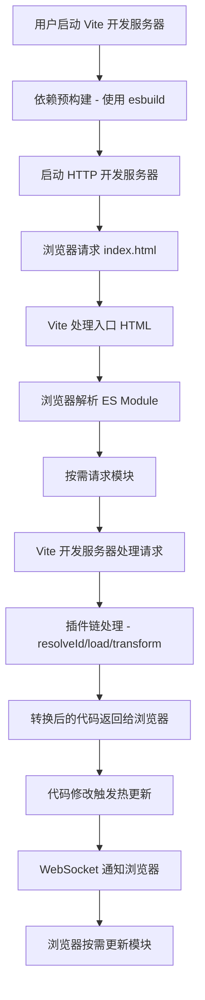
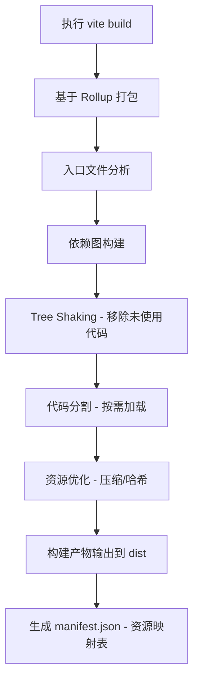

# 一、Vite 整体架构

> 📋 **本章内容：**
>
> - Vite 核心架构图
> - 开发环境 vs 生产环境流程对比
> - 核心模块概览
> - 与其他构建工具的架构差异

***

## 1. Vite 核心架构图

Vite 是一个基于 ESM 的新一代前端构建工具，其架构分为两大环境：

```
┌─────────────────────────────────────────────────────────────┐
│                        Vite 架构                              │
├─────────────────────────────────────────────────────────────┤
│                                                             │
│  ┌──────────────┐         ┌─────────────────┐               │
│  │  开发环境      │         │   生产环境        │               │
│  │  (Dev Server) │         │   (Rollup Build) │               │
│  └──────────────┘         └─────────────────┘               │
│         │                           │                        │
│         ▼                           ▼                        │
│  ┌──────────────┐         ┌─────────────────┐               │
│  │  原生 ESM     │         │   Rollup 打包    │               │
│  │  无需打包     │         │   优化构建产物   │               │
│  └──────────────┘         └─────────────────┘               │
│                                                             │
└─────────────────────────────────────────────────────────────┘
```

***

## 1. 前置知识

### 1.1 什么是 ESModule？

ESModule（ES 模块）是 JavaScript 的官方模块化系统，使用 `import` 和 `export` 语法。它是现代 JavaScript 的标准模块化方案，被所有现代浏览器原生支持。

### 1.2 浏览器如何解析 ESModule？

当浏览器遇到 `<script type="module">` 时，会：

1. 解析并执行主入口文件
2. 遇到 `import` 语句时，**按需请求**对应的模块文件
3. 构建模块依赖树
4. 按照正确的顺序执行所有模块

### 1.3 按需加载案例

```html
<!-- index.html -->
<script type="module">
  // 主入口
  import { init } from './app.js';
  init();
</script>
```

```javascript
// app.js
export function init() {
  console.log('App initialized');
  // 点击时才加载模块
  document.getElementById('btn').addEventListener('click', async () => {
    // 动态导入 - 按需加载！
    const { calculate } = await import('./math.js');
    const result = calculate(10, 20);
    console.log('Result:', result);
  });
}
```

```javascript
// math.js
export function calculate(a, b) {
  return a + b;
}
```

**执行流程**：

1. 页面加载时只加载 `app.js`
2. 点击按钮时才加载 `math.js`
3. 实现了真正的按需加载

### 1.4 Vite 优势

**开发环境下每个文件作为独立模块，按需请求**：

| 特性         | 说明            | 优势        |
| ---------- | ------------- | --------- |
| **原生 ESM** | 直接使用浏览器原生 ESM | 无需打包，启动快  |
| **按需请求**   | 浏览器请求时才转换模块   | 只处理需要的文件  |
| **独立模块**   | 每个文件都是独立模块    | 热更新精准，速度快 |
| **无打包开销**  | 开发环境无需等待打包    | 秒级启动，响应迅速 |

这种架构是 Vite 开发体验优秀的核心原因！

***

## 2. 开发环境流程详解

### 2.1 开发环境完整流程



### 2.2 开发环境的核心特点

| 特性         | 说明                       |
| ---------- | ------------------------ |
| **原生 ESM** | 直接使用浏览器原生 ESM，无需打包       |
| **按需加载**   | 浏览器请求时才转换对应模块，而不是一次性打包所有 |
| **快速启动**   | 无需等待整个项目打包，秒级启动          |
| **HMR**    | 基于 ESM 的精准热更新            |

***

## 3. 生产环境流程详解

### 3.1 生产环境完整流程



### 3.2 生产环境的核心特点

| 特性               | 说明                         |
| ---------------- | -------------------------- |
| **Rollup 打包**    | 使用成熟的 Rollup 进行打包，保证生产环境最优 |
| **Tree Shaking** | 自动移除未使用的代码                 |
| **代码分割**         | 支持动态导入，按需加载                |
| **资源哈希**         | 自动处理资源缓存                   |

***

## 4. 开发环境 vs 生产环境对比

| 维度       | 开发环境            | 生产环境      |
| -------- | --------------- | --------- |
| **核心工具** | Vite Dev Server | Rollup    |
| **打包方式** | 不打包，原生 ESM      | 完整打包      |
| **启动速度** | 秒级启动（依赖预构建后）    | 需要等待打包完成  |
| **更新速度** | 按需热更新（快）        | 完整重新打包（慢） |
| **构建目标** | 开发体验优先          | 性能优化优先    |
| **适用场景** | 日常开发            | 生产部署      |

***

## 5. Vite 核心模块概览

### 5.1 核心模块架构

```
Vite Core
├── server/              # 开发服务器
│   ├── index.ts        # 服务器入口
│   ├── ws.ts          # WebSocket 通信（HMR）
│   └── transformRequest.ts  # 请求转换
│
├── build/              # 生产构建
│   ├── index.ts       # 构建入口
│   ├── rollup.ts      # Rollup 集成
│   └── ssr.ts         # SSR 构建
│
├── plugins/            # 内置插件
│   ├── esbuild.ts     # esbuild 转换
│   ├── importAnalysis.ts  # 导入分析
│   └── ...
│
├── optimizer/          # 依赖预构建
│   ├── index.ts       # 优化器入口
│   ├── scan.ts        # 依赖扫描
│   └── esbuild.ts     # esbuild 集成
│
└── utils/              # 工具函数
    ├── config.ts      # 配置解析
    ├── resolve.ts     # 模块解析
    └── ...
```

### 5.2 核心模块职责

| 模块            | 职责                   |
| ------------- | -------------------- |
| **server**    | 开发服务器，处理 HTTP 请求，HMR |
| **build**     | 生产构建，Rollup 集成       |
| **optimizer** | 依赖预构建，esbuild 集成     |
| **plugins**   | 内置插件集合               |
| **utils**     | 配置解析、模块解析等工具         |

***

## 6. 与其他构建工具的架构差异

### 6.1 Vite vs Webpack

| 维度       | Vite          | Webpack        |
| -------- | ------------- | -------------- |
| **开发策略** | 原生 ESM + 按需加载 | 完整打包 + 内存编译    |
| **启动速度** | 秒级启动          | 随项目变大逐渐变慢      |
| **更新速度** | HMR 与模块数量无关   | HMR 随模块数量增加而变慢 |
| **生产构建** | Rollup        | Webpack 自身     |
| **学习曲线** | 简单，配置较少       | 复杂，配置较多        |

### 6.2 Vite vs Rollup

| 维度       | Vite                | Rollup    |
| -------- | ------------------- | --------- |
| **适用场景** | 完整开发工具链             | 专注打包库     |
| **开发环境** | 内置 Dev Server       | 需要配合其他工具  |
| **生产构建** | 基于 Rollup           | 自身就是打包器   |
| **插件生态** | Vite 插件 + Rollup 插件 | Rollup 插件 |

***

## 7. 关键架构决策

### 7.1 为什么选择原生 ESM？

- **浏览器原生支持**：现代浏览器已全面支持 ESM
- **无需打包开销**：开发环境无需等待打包
- **精准热更新**：只更新变化的模块
- **简化工具链**：减少构建复杂性

### 7.2 为什么选择 Rollup 做生产构建？

- **专注打包**：Rollup 专注库和应用打包
- **Tree Shaking 优秀**：ESM 原生支持，Tree Shaking 效果好
- **生态成熟**：丰富的插件生态
- **输出格式灵活**：支持多种输出格式

### 7.3 为什么选择 esbuild 做依赖预构建？

- **超高速**：Go 语言编写，比 JavaScript 快 10-100 倍
- **ESM 转换**：能将 CommonJS/UMD 转为 ESM
- **API 简单**：易于集成

***

## 8. 实验：对比开发环境和生产环境

### 8.1 观察第一次启动

```bash
# 在项目根目录执行
npm run dev
```

观察：

1. 启动时间（依赖预构建需要时间）
2. `node_modules/.vite` 目录是否生成
3. 浏览器网络请求（可以看到单个模块请求）

### 8.2 观察第二次启动

```bash
# 停止服务器，再次启动
npm run dev
```

观察：

1. 启动速度是否更快？
2. 是否跳过了依赖预构建？

### 8.3 对比生产构建

```bash
# 执行生产构建
npm run build
```

观察：

1. `dist` 目录的构建产物
2. 资源是否有哈希后缀
3. 是否有 `manifest.json`

***

## 10. 总结

Vite 的架构设计非常巧妙：

1. **开发环境**：原生 ESM + 按需加载，追求极致开发体验
2. **生产环境**：基于 Rollup 打包，追求最佳性能
3. **核心模块**：各司其职，职责清晰
4. **工具选择**：esbuild（预构建）+ Rollup（生产构建），各取所长

这种"开发环境不打包，生产环境才打包"的策略，是 Vite 体验好的核心原因！

***

## 📚 下一章

接下来让我们深入了解 Vite 最核心的特性之一：**\[依赖预构建]\(./2. 依赖预构建.md)** ⭐
