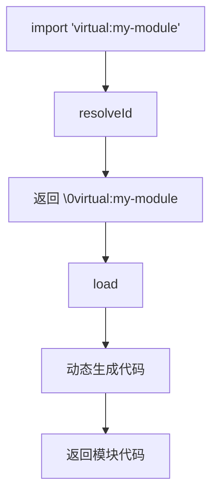

# 10. 虚拟模块系统

> 📋 **本章内容：**
> - 虚拟模块原理
> - Vite 内部虚拟模块（vite/client、@vite/env 等）
> - 插件如何使用虚拟模块

---

## 10.1 什么是虚拟模块

### 10.1.1 虚拟模块的概念

虚拟模块是**实际不存在的文件**，但可以像真实模块一样被导入和使用。

```typescript
// 导入虚拟模块
import config from 'virtual:config';
import env from '@vite/env';
import client from 'vite/client';
```

### 10.1.2 虚拟模块的特点

| 特性 | 说明 |
|------|------|
| 不存在 | 文件系统中没有真实文件 |
| 可导入 | 像普通模块一样导入 |
| 按需生成 | 需要时动态生成内容 |
| 前缀约定 | 通常以 `virtual:`、`@vite/` 等为前缀 |

---

## 10.2 Vite 内置虚拟模块

### 10.2.1 `@vite/env`

```typescript
import { MODE, DEV, PROD, BASE_URL } from '@vite/env';
console.log('Mode:', MODE);
console.log('Is dev:', DEV);
console.log('Base URL:', BASE_URL);
```

### 10.2.2 `vite/client`

```typescript
// Vite 自动注入，用于 HMR
import 'vite/client';
```

### 10.2.3 其他内置虚拟模块

```typescript
import * as viteHot from 'virtual:vite-hot';
import * as viteReact from 'virtual:vite/react';
```

---

## 10.3 插件中的虚拟模块

### 10.3.1 基本使用

```typescript
// vite-plugin-my-virtual
export default function myPlugin() {
  return {
    name: 'my-plugin',
    
    resolveId(id) {
      if (id === 'virtual:my-module') {
        // 标记为虚拟模块，避免被其他插件处理
        return '\0virtual:my-module';
      }
    },
    
    load(id) {
      if (id === '\0virtual:my-module') {
        return `
export const message = 'Hello from virtual module';
export const time = new Date().toLocaleTimeString();
`;
      }
    },
  };
}
```

### 10.3.2 使用虚拟模块

```typescript
// main.ts
import { message, time } from 'virtual:my-module';

console.log(message);
console.log('Generated at:', time);
```

---

## 10.4 虚拟模块原理

### 10.4.1 完整流程



### 10.4.2 `\0` 前缀的作用

```typescript
resolveId(id) {
  if (id === 'virtual:my-module') {
    // \0 是 Vite 约定的标记
    // 表示这是一个虚拟模块，避免与真实模块冲突
    return '\0virtual:my-module';
  }
}
```

| 特性 | 说明 |
|------|------|
| 避免冲突 | 真实文件路径不会以 `\0` 开头 |
| 标记作用 | 告诉 Vite 这是虚拟模块 |
| 特殊处理 | Vite 会特殊处理带 `\0` 的 ID |

---

## 10.5 高级虚拟模块

### 10.5.1 带参数的虚拟模块

```typescript
export default function myPlugin() {
  return {
    name: 'my-plugin',
    
    resolveId(id) {
      if (id.startsWith('virtual:data/')) {
        return `\0${id}`;
      }
    },
    
    load(id) {
      if (id.startsWith('\0virtual:data/')) {
        const dataId = id.slice(14); // 移除 '\0virtual:data/'
        return `
export const data = ${JSON.stringify({
  id: dataId,
  content: 'Dynamic content for ' + dataId,
})};
`;
      }
    },
  };
}

// 使用
import { data } from 'virtual:data/my-data-id';
```

### 10.5.2 带查询的虚拟模块

```typescript
export default function myPlugin() {
  return {
    name: 'my-plugin',
    
    resolveId(id) {
      if (id.startsWith('virtual:template?')) {
        return `\0${id}`;
      }
    },
    
    load(id) {
      if (id.startsWith('\0virtual:template?')) {
        const params = new URLSearchParams(id.slice(17));
        const name = params.get('name') || 'World';
        return `
export const message = 'Hello, ${name}!';
`;
      }
    },
  };
}

// 使用
import { message } from 'virtual:template?name=Vite';
```

---

## 10.6 实际应用场景

### 10.6.1 环境配置注入

```typescript
export default function configPlugin() {
  return {
    name: 'config-plugin',
    
    resolveId(id) {
      if (id === 'virtual:app-config') {
        return '\0virtual:app-config';
      }
    },
    
    load(id) {
      if (id === '\0virtual:app-config') {
        return `
export const config = {
  appName: 'My App',
  apiBase: '${process.env.API_BASE || '/api'}',
  version: '1.0.0',
};
`;
      }
    },
  };
}

// 使用
import { config } from 'virtual:app-config';
console.log('API Base:', config.apiBase);
```

### 10.6.2 虚拟数据模块

```typescript
export default function dataPlugin() {
  return {
    name: 'data-plugin',
    
    resolveId(id) {
      if (id === 'virtual:mock-data') {
        return '\0virtual:mock-data';
      }
    },
    
    load(id) {
      if (id === '\0virtual:mock-data') {
        const mockData = {
          users: [
            { id: 1, name: 'Alice' },
            { id: 2, name: 'Bob' },
          ],
          posts: [
            { id: 1, title: 'Hello World' },
          ],
        };
        
        return `
export const mockData = ${JSON.stringify(mockData)};
`;
      }
    },
  };
}
```

### 10.6.3 自定义文件格式

```typescript
export default function yamlPlugin() {
  return {
    name: 'yaml-plugin',
    
    resolveId(id) {
      if (id.endsWith('.yml') || id.endsWith('.yaml')) {
        return '\0yaml-virtual:' + id;
      }
    },
    
    load(id) {
      if (id.startsWith('\0yaml-virtual:')) {
        const filePath = id.slice(14);
        const yaml = fs.readFileSync(filePath, 'utf8');
        const data = yaml.parse(yaml);
        
        return `
export const data = ${JSON.stringify(data)};
`;
      }
    },
  };
}
```

---

## 10.7 实验：创建虚拟模块

### 实验 10.7.1：基础虚拟模块

1. 创建插件
2. 在 `main.ts` 中导入虚拟模块
3. 运行 `npm run dev`
4. 观察控制台输出

### 实验 10.7.2：带参数的虚拟模块

1. 创建带参数的虚拟模块
2. 使用不同参数导入
3. 观察结果

---

## 10.8 常见问题

### 问题 1：虚拟模块找不到？

**原因：** `resolveId` 没有正确处理

**解决方法：** 确保返回带 `\0` 的 ID

### 问题 2：虚拟模块在生产环境不工作？

**原因：** Rollup 需要特殊处理

**解决方法：** 确保插件钩子在构建时也执行

### 问题 3：虚拟模块没有被 HMR 更新？

**原因：** 需要处理热更新

**解决方法：** 使用 `handleHotUpdate`

---

## 10.9 总结

虚拟模块系统：

1. **动态生成**：虚拟模块不需要真实文件
2. **\0 前缀**：避免命名冲突
3. **resolveId + load**：配合使用
4. **应用场景**：配置注入、数据生成、自定义格式

理解虚拟模块可以开发更强大的插件！

---

## 📚 下一章

接下来让我们深入了解 Vite 的环境变量：**[环境变量与模式](./11. 环境变量与模式.md)**
