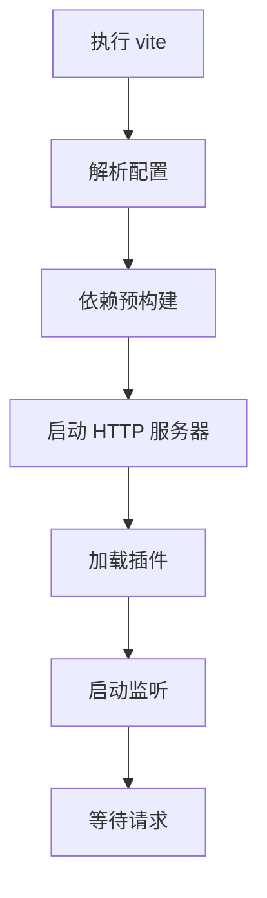
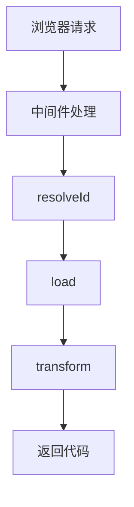

# 12. 源码阅读指南

> 📋 **本章内容：**
> - 项目结构
> - 核心模块解读（server/build/plugin）
> - 调试技巧

---

## 12.1 准备工作

### 12.1.1 克隆源码

```bash
git clone https://github.com/vitejs/vite.git
cd vite
pnpm install
```

### 12.1.2 项目结构

```
packages/
├── vite/              # 核心包
│   ├── src/
│   │   ├── node/     # Node.js 端代码
│   │   │   ├── server/
│   │   │   ├── build/
│   │   │   └── plugins/
│   │   └── client/   # 浏览器端代码
│   └── ...
└── ...
```

---

## 12.2 核心模块

### 12.2.1 Server（开发服务器）

```
src/node/server/
├── index.ts         # 服务器入口
├── ws.ts            # WebSocket 通信
├── transformRequest.ts  # 请求转换
├── hmr.ts           # HMR 相关
└── ...
```

### 12.2.2 Build（构建）

```
src/node/build/
├── index.ts         # 构建入口
├── rollup.ts        # Rollup 集成
└── ...
```

### 12.2.3 Plugins（插件）

```
src/node/plugins/
├── index.ts         # 插件管理
├── esbuild.ts       # esbuild 集成
├── css.ts           # CSS 处理
├── html.ts          # HTML 处理
└── ...
```

---

## 12.3 关键流程

### 12.3.1 开发服务器启动流程



### 12.3.2 请求处理流程



---

## 12.4 调试 Vite 源码

### 12.4.1 VSCode 调试配置

```json
{
  "version": "0.2.0",
  "configurations": [
    {
      "type": "node",
      "request": "launch",
      "name": "Debug Vite",
      "program": "${workspaceFolder}/packages/vite/bin/vite.js",
      "args": ["dev"],
      "cwd": "${workspaceFolder}/playground/your-app",
      "runtimeExecutable": "pnpm",
      "console": "integratedTerminal"
    }
  ]
}
```

### 12.4.2 添加断点

```typescript
// src/node/server/index.ts
export async function createServer(options: ServerOptions) {
  // 在这里添加断点
  debugger;
  
  const server = new ViteDevServer(options);
  // ...
}
```

---

## 12.5 关键代码位置

### 12.5.1 依赖预构建

```
src/node/optimizer/
├── index.ts         # 预构建入口
├── scan.ts          # 依赖扫描
├── esbuild.ts       # esbuild 集成
└── ...
```

### 12.5.2 HMR

```
src/node/server/
├── hmr.ts           # HMR 逻辑
├── ws.ts            # WebSocket 通信
└── ...
```

### 12.5.3 模块转换

```
src/node/plugins/
├── esbuild.ts       # JS/TS 转换
├── css.ts           # CSS 处理
└── ...
```

---

## 12.6 源码阅读方法

### 12.6.1 从入口开始

```typescript
// src/node/cli.ts
async function run() {
  // 这是 Vite CLI 的入口
  const commands = {
    dev: startDevServer,
    build: runBuild,
    preview: startPreviewServer,
  };
}
```

### 12.6.2 按功能阅读

1. 先看整体架构
2. 再看核心流程
3. 最后看具体实现

### 12.6.3 使用 print 调试

```typescript
// 添加打印语句
console.log('[Debug]', id);
```

---

## 12.7 实验：调试源码

### 12.7.1 准备测试项目

```bash
# 在 playground 目录创建项目
cd playground
pnpm create vite my-test-app
cd my-test-app
```

### 12.7.2 启动调试

1. 在 VSCode 中设置断点
2. 启动调试配置
3. 在浏览器中访问
4. 观察断点触发

---

## 12.8 贡献指南

### 12.8.1 提交代码流程

```bash
# 1. 从 main 创建分支
git checkout main
git checkout -b my-feature

# 2. 编写代码

# 3. 运行测试
pnpm test

# 4. 提交代码
git add .
git commit -m "feat: add my feature"
```

### 12.8.2 运行测试

```bash
# 运行所有测试
pnpm test

# 运行特定测试
pnpm test vitest/basic

# 运行单个测试文件
pnpm test packages/vite/__tests__/build.ts
```

---

## 12.9 总结

源码阅读指南：

1. **项目结构**：了解核心模块组织
2. **关键流程**：启动、请求处理等
3. **调试技巧**：如何在 VSCode 中调试
4. **贡献流程**：如何提交代码

通过源码阅读可以更深入地理解 Vite 的实现！

---

## 📚 原理篇完成！

恭喜你完成了 Vite 原理篇的学习！你已经对 Vite 有了深入的理解。
