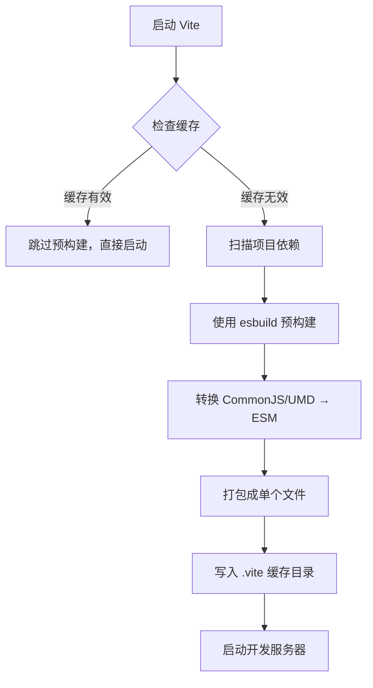

# 2. 依赖预构建 ⭐ 核心特性

> 📋 **本章内容：**
> - 为什么需要预构建？
> - CommonJS/UMD → ESM 转换
> - esbuild 的作用与优势
> - 预构建流程详解
> - 缓存机制（`.vite` 目录）
> - 依赖发现和预构建触发条件
> - 实验：观察第一次启动 vs 第二次启动的差异

---

## 2.1 为什么需要预构建？

预构建是 Vite 性能优势的核心，主要解决以下问题：

### 2.1.1 问题 1：CommonJS/UMD 兼容性

浏览器原生只支持 ESM，但 `node_modules` 中大量存在 CommonJS/UMD 包。

**例如：**
```javascript
// CommonJS 格式（浏览器不支持）
const lodash = require('lodash');
module.exports = { foo: 'bar' };
```

需要预构建将其转换为 ESM 格式。

### 2.1.2 问题 2：大量小文件性能问题

很多包由成百上千个小文件组成（如 `lodash-es`），浏览器逐个请求会很慢。

**例如：**
```
lodash-es/
├── chunk1.js
├── chunk2.js
├── ...
└── chunk100.js
```

预构建将这些小文件打包成单个文件，减少 HTTP 请求。

### 2.1.3 问题 3：重复解析开销

不预构建的话，每次启动都要重新解析依赖，造成不必要的开销。

---

## 2.2 CommonJS/UMD → ESM 转换

### 2.2.1 CommonJS 转 ESM 示例

**转换前（CommonJS）：**
```javascript
// utils.js
function add(a, b) {
  return a + b;
}

module.exports = { add };

// main.js
const { add } = require('./utils');
console.log(add(1, 2));
```

**转换后（ESM）：**
```javascript
// utils.js
function add(a, b) {
  return a + b;
}

export { add };

// main.js
import { add } from './utils';
console.log(add(1, 2));
```

### 2.2.2 UMD 转 ESM 示例

UMD（Universal Module Definition）是一种兼容多种模块系统的格式，预构建会将其转换为 ESM。

---

## 2.3 esbuild 的作用与优势

### 2.3.1 为什么选择 esbuild？

| 特性 | 说明 |
|------|------|
| **Go 语言编写** | 比 JavaScript 构建工具快 10-100 倍 |
| **ESM 转换** | 完美支持 CommonJS/UMD → ESM |
| **高性能打包** | 能快速处理大量文件 |
| **简单 API** | 易于集成到 Vite |

### 2.3.2 esbuild vs 其他工具对比

| 工具 | 语言 | 速度 | 适用场景 |
|------|------|------|---------|
| **esbuild** | Go | ⚡⚡⚡⚡⚡ 超快 | Vite 依赖预构建 |
| **Rollup** | JavaScript | ⚡⚡ 一般 | Vite 生产构建 |
| **Webpack** | JavaScript | ⚡ 较慢 | 传统项目打包 |

---

## 2.4 预构建流程详解



### 2.4.1 步骤 1：检查缓存

Vite 会检查 `node_modules/.vite/_metadata.json` 判断缓存是否有效。

### 2.4.2 步骤 2：扫描依赖

分析项目代码中的 `import` 语句，找出所有需要预构建的依赖。

**扫描的示例：**
```javascript
// main.js
import React from 'react';           // 扫描到 react
import ReactDOM from 'react-dom';   // 扫描到 react-dom
import lodash from 'lodash';         // 扫描到 lodash
```

### 2.4.3 步骤 3：esbuild 预构建

使用 esbuild 将依赖打包转换为 ESM 格式。

### 2.4.4 步骤 4：写入缓存

将预构建结果写入 `node_modules/.vite` 目录。

---

## 2.5 缓存机制（`.vite` 目录）

### 2.5.1 `.vite` 目录结构

```
node_modules/.vite/
├── _metadata.json         # 缓存元数据
├── react.js               # 预构建的 react
├── react.js.map           # Source Map
├── react-dom.js           # 预构建的 react-dom
├── lodash.js              # 预构建的 lodash
└── ...
```

### 2.5.2 `_metadata.json` 格式

```json
{
  "hash": "abc123...",  // 缓存哈希（由依赖列表计算）
  "optimizer": {
    "esbuildVersion": "0.20.0"
  },
  "browserHash": "def456...",
  "deps": {
    "react": {
      "file": "node_modules/.vite/react.js",
      "src": "node_modules/react/index.js",
      "needsInterop": true
    },
    "react-dom": {
      "file": "node_modules/.vite/react-dom.js",
      "src": "node_modules/react-dom/index.js",
      "needsInterop": true
    }
  }
}
```

### 2.5.3 缓存哈希计算

缓存哈希由以下因素计算：

- `package.json` 的 `dependencies`/`devDependencies`
- Vite 配置中的 `optimizeDeps` 配置
- `package-lock.json`/`yarn.lock`/`pnpm-lock.yaml`

任何一个变化都会导致缓存失效。

---

## 2.6 依赖发现和预构建触发条件

### 2.6.1 自动发现依赖

Vite 通过以下方式自动发现需要预构建的依赖：

1. **扫描源代码中的 `import` 语句**
2. **扫描 `index.html`**
3. **解析 CSS 中的 `@import`**

### 2.6.2 手动配置依赖

通过 `vite.config.ts` 手动配置需要预构建的依赖：

```typescript
import { defineConfig } from 'vite';

export default defineConfig({
  optimizeDeps: {
    // 需要强制预构建的依赖
    include: ['some-large-package', 'another-package'],
    
    // 不需要预构建的依赖（一般用于 ESM-only 包）
    exclude: ['some-esm-only-package']
  }
});
```

### 2.6.3 预构建触发条件

以下情况会触发预构建：

1. **第一次启动项目**
2. **删除了 `node_modules/.vite` 目录**
3. **修改了 `package.json` 的依赖**
4. **修改了 `vite.config.ts` 的 `optimizeDeps` 配置**
5. **修改了锁文件（`package-lock.json` 等）**

---

## 2.7 实验：观察第一次启动 vs 第二次启动的差异

### 实验 2.7.1：删除缓存，第一次启动

```bash
# 1. 删除缓存目录
rm -rf node_modules/.vite

# 2. 启动 Vite
npm run dev
```

**观察：**
1. 启动时间（应该较慢，因为需要预构建）
2. 控制台是否输出 "Pre-bundling dependencies"
3. `node_modules/.vite` 目录是否生成

### 实验 2.7.2：第二次启动（使用缓存）

```bash
# 1. 停止服务器（Ctrl+C）
# 2. 再次启动
npm run dev
```

**观察：**
1. 启动时间（应该快很多）
2. 是否跳过了预构建？
3. `node_modules/.vite` 目录是否复用？

### 实验 2.7.3：修改依赖，触发重新预构建

```bash
# 1. 安装一个新依赖
npm install dayjs

# 2. 在 main.js 中添加
import dayjs from 'dayjs';

# 3. 重新启动
npm run dev
```

**观察：**
1. 是否触发了重新预构建？
2. `node_modules/.vite/_metadata.json` 的哈希是否变化？

---

## 2.8 预构建配置

### 2.8.1 基本配置

```typescript
import { defineConfig } from 'vite';

export default defineConfig({
  optimizeDeps: {
    // 强制包含的依赖
    include: ['react', 'react-dom', 'lodash'],
    
    // 排除的依赖（ESM-only 包）
    exclude: ['some-esm-only-package'],
    
    // esbuild 选项
    esbuildOptions: {
      target: 'es2020'
    }
  }
});
```

### 2.8.2 特殊场景配置

#### 场景 1：动态导入的依赖需要预构建

```typescript
// 这种动态导入的依赖可能不会被自动扫描
const module = await import('some-dependency');

// 需要手动配置
export default defineConfig({
  optimizeDeps: {
    include: ['some-dependency']
  }
});
```

#### 场景 2：Monorepo 场景

```typescript
// Monorepo 中可能需要预构建 workspace 包
export default defineConfig({
  optimizeDeps: {
    include: ['@my-org/utils']
  }
});
```

---

## 2.9 常见问题

### 问题 1：预构建后还是有很多请求？

**原因：** 某些依赖是 ESM-only 的，不需要预构建。

**解决：** 这是正常的，Vite 会按需加载。

### 问题 2：如何强制重新预构建？

**方法 1：** 删除缓存目录
```bash
rm -rf node_modules/.vite
```

**方法 2：** 使用 `--force` 选项
```bash
npm run dev -- --force
```

### 问题 3：预构建很慢？

**原因：** 依赖很多或有大型依赖。

**解决：** 这是正常的，第一次构建需要时间，之后会很快。

---

## 2.10 总结

依赖预构建是 Vite 性能的核心：

1. **解决兼容性**：CommonJS/UMD → ESM
2. **提升性能**：打包成单个文件，减少请求
3. **缓存机制**：避免重复构建，二次启动飞快
4. **esbuild**：Go 语言，超高速

理解依赖预构建是深入理解 Vite 的关键！

---

## 📚 下一章

接下来让我们深入了解 Vite 的模块解析机制：**[ES Module 模块解析](./3. 模块解析.md)**
