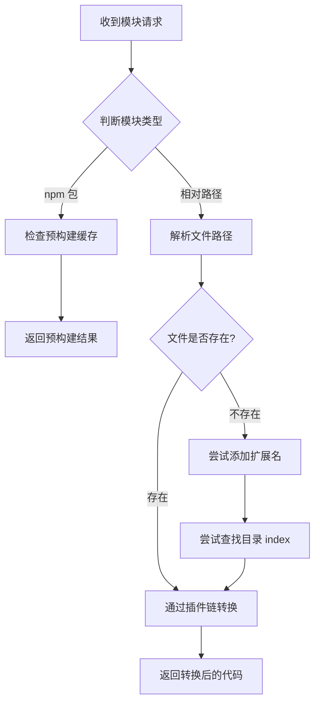
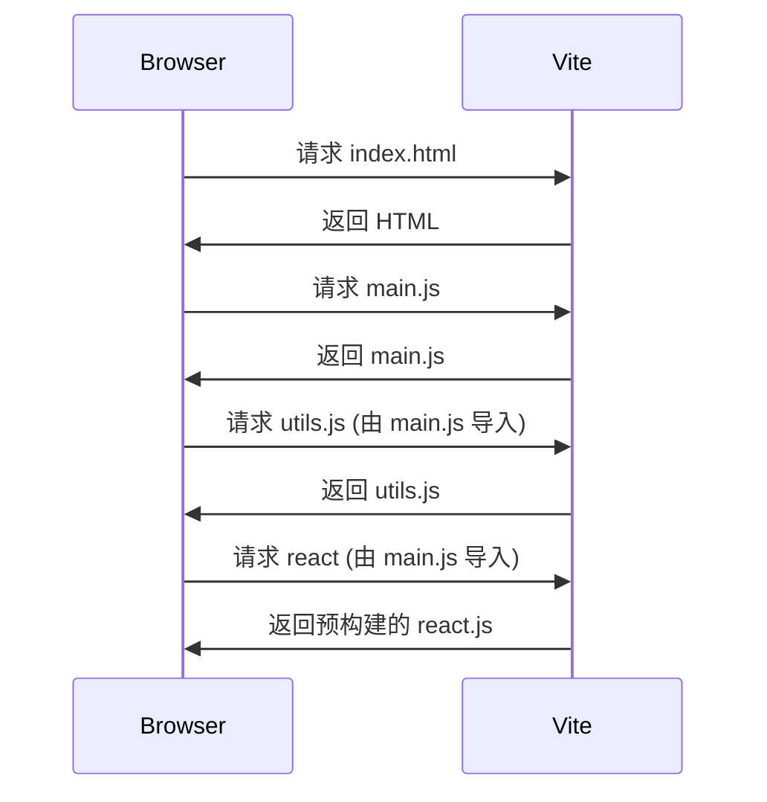

# 3. ES Module 模块解析

> 📋 **本章内容：**
> - 浏览器原生 ESM
> - Vite 的模块解析算法
> - 路径别名处理
> - node_modules 解析
> - 模块加载顺序

---

## 3.1 浏览器原生 ESM

### 3.1.1 ESM 基础

现代浏览器原生支持 ES Module，可以直接在浏览器中使用：

```html
<script type="module">
  // 浏览器原生支持 ESM
  import { add } from './utils.js';
  console.log(add(1, 2));
</script>
```

### 3.1.2 浏览器 ESM 的限制

| 特性 | 说明 |
|------|------|
| **只能使用绝对路径或相对路径** | 不能像 Node.js 那样直接 `import 'lodash'` |
| **需要完整扩展名** | 必须写 `./utils.js`，不能写 `./utils` |
| **CORS 限制** | 需要 HTTP 服务器，不能用 `file://` 协议 |

---

## 3.2 Vite 的模块解析算法

Vite 解决了浏览器 ESM 的限制，提供了更友好的模块解析。

### 3.2.1 解析流程



### 3.2.2 解析示例

```javascript
// 源代码
import React from 'react';                  // npm 包
import { App } from './App';               // 相对路径
import utils from '@/utils';               // 路径别名
```

**Vite 解析过程：**
1. `react` → 预构建缓存 → `node_modules/.vite/react.js`
2. `./App` → 尝试 `./App.js`、`./App.tsx` 等
3. `@/utils` → 路径别名解析 → `src/utils.js`

---

## 3.3 路径别名处理

### 3.3.1 配置路径别名

```typescript
// vite.config.ts
import { defineConfig } from 'vite';
import path from 'path';

export default defineConfig({
  resolve: {
    alias: {
      '@': path.resolve(__dirname, './src'),
      '@components': path.resolve(__dirname, './src/components'),
      '@utils': path.resolve(__dirname, './src/utils')
    }
  }
});
```

### 3.3.2 使用路径别名

```javascript
// 源代码
import Button from '@components/Button';
import { formatDate } from '@utils/date';

// Vite 解析后
import Button from '/src/components/Button';
import { formatDate } from '/src/utils/date';
```

### 3.3.3 TypeScript 配置

为了让 TypeScript 也能识别路径别名，需要配置 `tsconfig.json`：

```json
{
  "compilerOptions": {
    "baseUrl": ".",
    "paths": {
      "@/*": ["src/*"],
      "@components/*": ["src/components/*"],
      "@utils/*": ["src/utils/*"]
    }
  }
}
```

---

## 3.4 node_modules 解析

### 3.4.1 解析策略

```javascript
// 源代码
import lodash from 'lodash';
```

**Vite 解析流程：**
1. 检查是否在预构建列表中
2. 如果是 → 返回预构建结果
3. 如果不是 → 直接从 `node_modules` 加载

### 3.4.2 解析 `package.json` 字段

```json
{
  "name": "lodash",
  "main": "dist/lodash.js",
  "module": "dist/lodash.esm.js",
  "exports": {
    ".": {
      "import": "./dist/lodash.esm.js",
      "require": "./dist/lodash.js"
    }
  }
}
```

Vite 按以下优先级查找：
1. `exports` 字段（优先）
2. `module` 字段
3. `main` 字段

---

## 3.5 模块加载顺序

### 3.5.1 浏览器加载顺序



### 3.5.2 依赖图构建

Vite 会构建模块依赖图，确保按正确顺序加载：

```
index.html
  └── main.js
        ├── utils.js
        ├── react
        └── App.jsx
              └── Button.jsx
```

---

## 3.6 实验：观察模块解析过程

### 实验 3.6.1：查看网络请求

```bash
npm run dev
```

打开浏览器开发者工具 → Network 标签

观察：
1. 模块请求的顺序
2. npm 包的请求 URL（应该是 `/node_modules/.vite/...`）
3. 路径别名的解析结果

### 实验 3.6.2：测试路径别名

```typescript
// vite.config.ts
export default defineConfig({
  resolve: {
    alias: {
      '@': path.resolve(__dirname, './src')
    }
  }
});
```

```javascript
// src/main.js
import App from '@/App';
```

观察：
1. 浏览器请求的实际路径是什么？
2. Vite 是如何转换路径别名的？

### 实验 3.6.3：测试扩展名省略

```javascript
// src/main.js
import App from './App';  // 省略扩展名
```

观察：
1. Vite 尝试了哪些扩展名？
2. 最终加载了哪个文件？

---

## 3.7 常见问题

### 问题 1：模块找不到？

**可能原因：**
1. 路径写错了
2. 路径别名配置错误
3. 没有安装依赖

**解决方法：**
1. 检查路径是否正确
2. 检查 `vite.config.ts` 的 `resolve.alias`
3. 检查 `package.json` 是否有该依赖

### 问题 2：路径别名 TypeScript 报错？

**原因：** 没有配置 `tsconfig.json`

**解决方法：** 配置 `compilerOptions.paths`

### 问题 3：如何查看模块解析过程？

**方法：** 使用 `--debug` 选项
```bash
npm run dev -- --debug
```

---

## 3.8 总结

Vite 的模块解析解决了浏览器 ESM 的限制：

1. **路径别名**：简化模块导入
2. **扩展名省略**：更友好的开发体验
3. **npm 包解析**：与预构建集成
4. **完整解析策略**：灵活且强大

理解模块解析有助于更好地使用 Vite！

---

## 📚 下一章

接下来让我们深入了解 Vite 的热更新机制：**[热模块替换（HMR）原理](./4. HMR 原理.md)**
