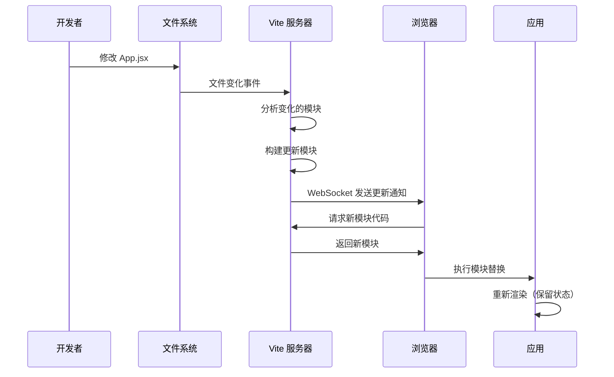

# 四、热模块替换（HMR）原理

> 📋 **本章内容：**
> - HMR 原理详解
> - WebSocket 通信机制
> - 模块边界识别
> - 不同框架的 HMR 实现
> - 实验：观察 HMR 的网络请求

---

## 1. HMR 是什么？

**HMR（Hot Module Replacement）** 是指在应用运行时，无需刷新页面即可替换、添加或删除模块的能力。

### 1.1 HMR 的优势

| 特性 | 说明 |
|------|------|
| **无需刷新页面** | 保存应用状态，开发体验好 |
| **只更新变化的模块** | 更新速度快 |
| **保留组件状态** | 不会丢失表单输入等状态 |

---

## 2. HMR 原理详解

### 2.1 完整 HMR 流程



### 2.2 核心步骤

1. **文件监控**：监控文件变化
2. **变化检测**：识别变化的模块
3. **WebSocket 通知**：通知浏览器
4. **模块更新**：加载新模块
5. **组件重渲染**：保留状态更新

---

## 3. WebSocket 通信机制

### 3.1 WebSocket 连接建立

```javascript
// vite/client（Vite 自动注入的客户端代码）
const socket = new WebSocket('ws://localhost:5173');

socket.onopen = () => {
  console.log('[vite] HMR connected');
};

socket.onmessage = (event) => {
  const message = JSON.parse(event.data);
  handleHMRMessage(message);
};
```

### 3.2 HMR 消息类型

| 消息类型 | 说明 |
|---------|------|
| `connected` | 连接建立 |
| `update` | 模块更新 |
| `full-reload` | 页面刷新 |
| `error` | 错误 |

**update 消息示例：**
```json
{
  "type": "update",
  "updates": [
    {
      "type": "js-update",
      "path": "/src/App.jsx",
      "acceptedPath": "/src/App.jsx"
    }
  ]
}
```

---

## 4. 模块边界识别

### 4.1 accept 的概念

HMR 需要明确哪些模块可以更新，通过 `accept` 接受更新：

```javascript
// main.js
import { createApp } from 'vue';
import App from './App.vue';

const app = createApp(App);
app.mount('#app');

// HMR accept 声明
if (import.meta.hot) {
  import.meta.hot.accept('./App.vue', (newApp) => {
    app.unmount();
    createApp(newApp).mount('#app');
  });
}
```

### 4.2 模块边界

```
index.html
  └── main.js
        ├── App.jsx (accept 边界)
        │     ├── Button.jsx
        │     └── Header.jsx
        └── utils.js
```

当修改 `Button.jsx` 时，更新会冒泡到 `App.jsx`，由 `App.jsx` 的 accept 处理。

---

## 5. 不同框架的 HMR 实现

### 5.1 React + React Fast Refresh

```javascript
// vite/client 自动注入
if (import.meta.hot) {
  const { createHotContext } = await import('/@vite/client');
  const hot = createHotContext('/src/App.jsx');
  
  hot.accept((newModule) => {
    ReactFastRefresh.update(module, newModule);
  });
}
```

**特点：**
- 保留组件状态
- 使用 Fiber 树
- 由 React Fast Refresh 处理

### 5.2 Vue + Vite HMR

```javascript
// Vite 自动注入
if (import.meta.hot) {
  import.meta.hot.accept();
}
```

**特点：**
- Vue 单文件组件原生支持
- 保留组件状态
- 由 Vite 自动处理

### 5.3 原生 JavaScript

```javascript
// 手动 HMR 处理
if (import.meta.hot) {
  import.meta.hot.accept((newModule) => {
    console.log('模块更新了', newModule);
  });
}
```

---

## 6. `import.meta.hot` API

### 6.1 常用 API

| API | 说明 |
|-----|------|
| `hot.accept()` | 接受自己的更新 |
| `hot.accept(deps, cb)` | 接受依赖的更新 |
| `hot.dispose(cb)` | 清理副作用 |
| `hot.data` | 在模块更新间共享数据 |

### 6.2 完整示例

```javascript
let timer;

function init() {
  timer = setInterval(() => {
    console.log('tick');
  }, 1000);
}

init();

if (import.meta.hot) {
  import.meta.hot.dispose(() => {
    // 清理：清除定时器
    clearInterval(timer);
  });

  import.meta.hot.accept((newModule) => {
    console.log('模块已更新');
  });
}
```

---

## 7. 实验：观察 HMR 的网络请求

### 7.1 观察 HMR WebSocket

```bash
npm run dev
```

打开浏览器开发者工具 → Network 标签

观察：
1. WebSocket 连接是否建立？
2. 修改文件后是否有消息？

### 7.2 观察模块更新请求

1. 修改 `src/App.jsx`
2. 保存文件
3. 观察 Network 标签

观察：
1. 是否请求了新的模块？
2. 请求的 URL 是什么？
3. 是否有页面刷新？

### 7.3 测试状态保留

1. 在 `App.jsx` 中添加一个输入框
2. 在输入框中输入一些文字
3. 修改其他部分（不是输入框）
4. 保存文件

观察：
1. 页面刷新了吗？
2. 输入框的文字还在吗？

---

## 8. 何时会触发页面刷新？

### 8.1 刷新场景

| 场景 | 原因 |
|------|------|
| 修改了 `index.html` | 页面入口 |
| 修改了依赖（如 `package.json`） | 需要重新预构建 |
| CSS 文件导入了新依赖 | 可能需要刷新 |
| 没有 accept 边界 | 无法处理更新 |
| 运行时错误 | 避免错误状态 |

### 8.2 查看 HMR 日志

浏览器控制台中会输出详细的 HMR 日志：

```
[vite] hmr update /src/App.jsx
[vite] hot updated: /src/App.jsx
```

---

## 9. 常见问题

### 问题 1：HMR 不工作，总是刷新页面？

**可能原因：**
1. 没有 accept 边界
2. 发生了运行时错误
3. 修改了不支持 HMR 的文件

**解决方法：**
1. 检查控制台是否有错误
2. 检查是否有 accept 声明
3. 查看 HMR 日志

### 问题 2：状态丢失了？

**可能原因：**
1. 组件被卸载和重新挂载
2. 使用了不保留状态的模式

**解决方法：**
1. 检查 accept 逻辑
2. 使用框架推荐的 HMR 方式

### 问题 3：如何调试 HMR？

**方法：**
1. 查看浏览器控制台的 HMR 日志
2. 使用 `debugger` 断点
3. 查看 WebSocket 消息

---

## 10. 总结

HMR 是 Vite 开发体验好的关键：

1. **WebSocket 通信**：实时通知更新
2. **accept 边界**：明确更新范围
3. **框架集成**：各框架的 HMR 机制
4. **状态保留**：避免重新加载

理解 HMR 有助于更好地进行开发！

---

## 📚 下一章

接下来让我们深入了解 Vite 的缓存机制：**[缓存机制](./5. 缓存机制.md)**
