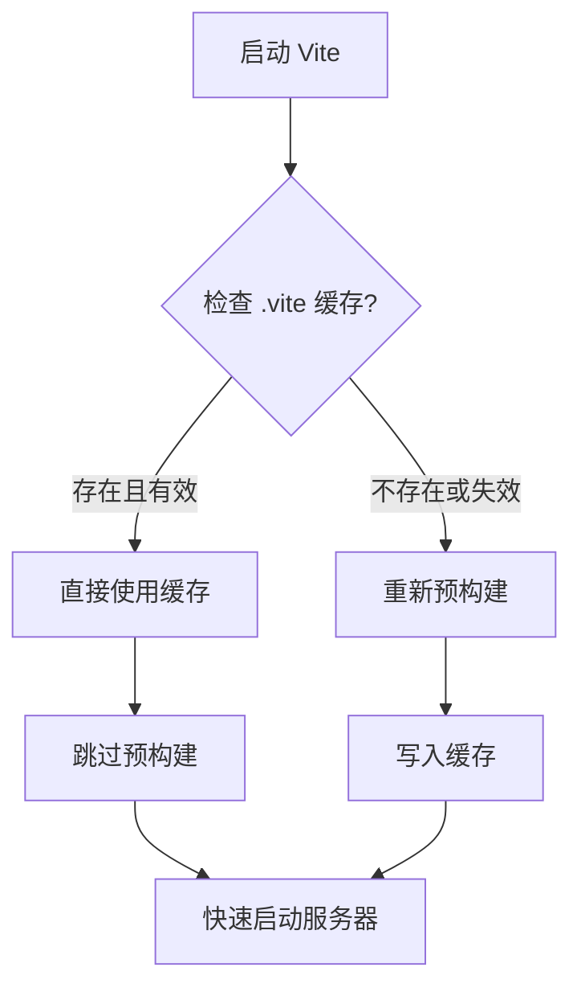

# 五、缓存机制

> 📋 **本章内容：**
> - 浏览器缓存策略
> - 文件系统缓存（`.vite` 目录）
> - 依赖缓存失效机制
> - 为什么第二次启动更快？
> - 实验：删除 `.vite` 目录观察效果

---

## 1. Vite 的多层缓存

Vite 使用了多层缓存策略，确保开发体验最佳：

| 缓存层 | 位置 | 说明 |
|--------|------|------|
| **浏览器缓存** | 浏览器 | HTTP 缓存，避免重复请求 |
| **内存缓存** | Vite 内存 | 已转换模块的缓存 |
| **文件系统缓存** | `node_modules/.vite` | 依赖预构建缓存 |

---

## 2. 浏览器缓存策略

### 2.1 HTTP 缓存头

Vite 会设置合适的缓存头：

```http
Cache-Control: no-cache, no-store, must-revalidate
```

**对于预构建依赖：**
```http
Cache-Control: public, max-age=31536000, immutable
```

### 2.2 缓存策略对比

| 文件类型 | 缓存策略 |
|---------|---------|
| 源代码文件 | `no-cache`，每次验证 |
| 预构建依赖 | `immutable`，长期缓存 |
| 资源文件 | 根据内容哈希 |

---

## 3. 文件系统缓存（`.vite` 目录）

### 3.1 `.vite` 目录详解

```
node_modules/.vite/
├── _metadata.json         # 缓存元数据
├── react.js               # 预构建的 react
├── react.js.map           # Source Map
├── react-dom.js           # 预构建的 react-dom
└── deps_cache/             # 依赖缓存
```

### 3.2 `_metadata.json` 详解

```json
{
  "hash": "abc123...",
  "browserHash": "def456...",
  "optimizer": {
    "esbuildVersion": "0.20.0"
  },
  "deps": {
    "react": {
      "file": "node_modules/.vite/react.js",
      "src": "node_modules/react/index.js",
      "needsInterop": true
    }
  }
}
```

---

## 4. 依赖缓存失效机制

### 4.1 缓存哈希计算

缓存哈希由以下因素计算：

```
缓存哈希 = hash(
  package.json dependencies +
  vite.config.ts optimizeDeps +
  lock 文件内容 +
  Vite 版本
)
```

### 4.2 触发缓存失效的场景

| 场景 | 说明 |
|------|------|
| 修改 `package.json` 依赖 | 添加/删除依赖 |
| 修改 `vite.config.ts` 的 `optimizeDeps` | 修改预构建配置 |
| 修改 `package-lock.json` | 锁文件变化 |
| 更新 Vite 版本 | 内部变化 |
| 手动删除 `.vite` 目录 | 强制重新构建 |

---

## 5. 为什么第二次启动更快？

### 5.1 启动时间对比

| 启动次数 | 预构建时间 | 总启动时间 |
|---------|-----------|----------|
| 第一次 | 5-30 秒 | 5-30 秒 |
| 第二次 | 0 秒 | 1-3 秒 |

### 5.2 缓存命中后的流程



---

## 6. 内存缓存

### 6.1 内存缓存原理

Vite 会在内存中缓存已转换的模块：

```javascript
// Vite 内部实现示意
const moduleCache = new Map();

async function transformRequest(url) {
  if (moduleCache.has(url)) {
    return moduleCache.get(url);
  }
  
  const result = await doTransform(url);
  moduleCache.set(url, result);
  return result;
}
```

### 6.2 内存缓存失效

文件变化时，对应的内存缓存会失效：

```javascript
// 文件变化时清理缓存
function handleFileChange(file) {
  const cacheKey = getCacheKey(file);
  moduleCache.delete(cacheKey);
}
```

---

## 7. 实验：删除 `.vite` 目录观察效果

### 7.1 删除 `.vite` 目录

```bash
# 1. 删除缓存目录
rm -rf node_modules/.vite

# 2. 启动 Vite
npm run dev
```

观察：
1. 是否触发了预构建？
2. 启动时间多长？
3. `.vite` 目录是否重新生成？

### 7.2 第二次启动（使用缓存）

```bash
# 1. 停止服务器（Ctrl+C）
# 2. 再次启动
npm run dev
```

观察：
1. 是否跳过了预构建？
2. 启动时间多长？

### 7.3 修改 `package.json` 触发失效

```bash
# 1. 安装一个新依赖
npm install dayjs

# 2. 在 main.js 中使用
import dayjs from 'dayjs';

# 3. 重新启动
npm run dev
```

观察：
1. 是否触发了重新预构建？
2. 缓存哈希是否变化？

---

## 8. 缓存配置

### 8.1 强制重新预构建

```bash
# 使用 --force 选项
npm run dev -- --force
```

### 8.2 禁用预构建

```typescript
// vite.config.ts
export default defineConfig({
  optimizeDeps: {
    noDiscovery: true  // 禁用自动依赖发现
  }
});
```

---

## 9. 常见问题

### 问题 1：如何手动清理缓存？

**方法 1：** 删除缓存目录
```bash
rm -rf node_modules/.vite
```

**方法 2：** 使用 --force
```bash
npm run dev -- --force
```

### 问题 2：缓存总是失效了但还是很慢？

**原因：**
1. 没有配置了依赖经常变动
2. 锁文件不稳定
3. Vite 版本更新

**解决方法：**
1. 检查是否有不必要的依赖频繁变动
2. 固定依赖版本

### 问题 3：如何查看缓存状态？

**方法：** 查看 `node_modules/.vite/_metadata.json`
```bash
cat node_modules/.vite/_metadata.json
```

---

## 10. 总结

Vite 的缓存机制是快速启动的关键：

1. **多层缓存**：浏览器 → 内存 → 文件系统
2. **智能失效**：根据依赖变化自动失效
3. **快速启动**：第二次启动飞快
4. **预构建缓存**：`.vite` 目录

理解缓存机制有助于优化开发体验！

---

## 📚 下一章

接下来让我们深入了解 Vite 的静态资源和 CSS 处理：**[静态资源与 CSS 处理](./6. 静态资源与 CSS 处理.md)**
