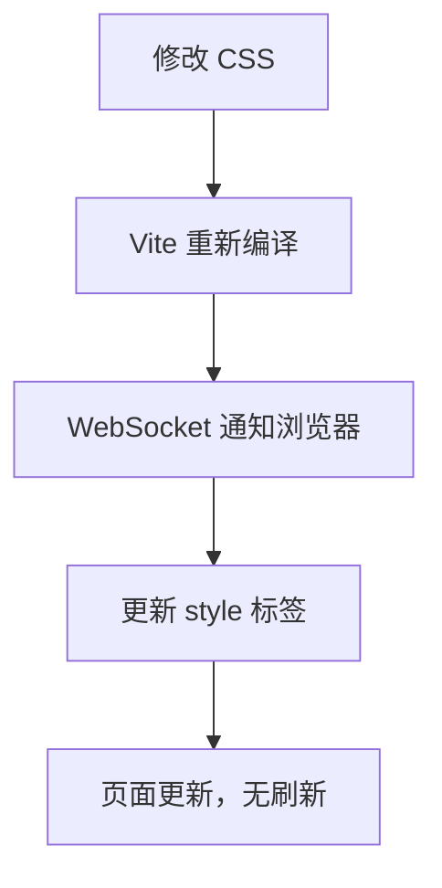

# 6. 静态资源与 CSS 处理

> 📋 **本章内容：**
> - 静态资源加载策略
> - 资源内联 vs 单独文件
> - CSS Modules 支持
> - PostCSS 集成
> - 资源 URL 重写
> - CSS 热更新

---

## 6.1 静态资源处理

### 6.1.1 支持的资源类型

| 资源类型 | 扩展名 |
|---------|-------|
| 图片 | `.jpg`, `.jpeg`, `.png`, `.gif`, `.svg`, `.webp` |
| 媒体 | `.mp4`, `.webm`, `.mp3`, `.wav`, `.flac` |
| 字体 | `.woff`, `.woff2`, `.eot`, `.ttf`, `.otf` |
| 其他 | `.json`, `.wasm` |

### 6.1.2 资源引用方式

```javascript
// 1. 直接引用
import logo from './assets/logo.png';

// 2. 作为 URL
const url = new URL('./assets/logo.png', import.meta.url);

// 3. 在模板中使用

```

---

## 6.2 资源内联 vs 单独文件

### 6.2.1 内联策略

Vite 会根据文件大小决定是内联还是单独文件：

| 文件大小 | 处理方式 |
|---------|---------|
| < 4kb | 内联为 base64 |
| ≥ 4kb | 单独文件 + 哈希 |

### 6.2.2 配置内联阈值

```typescript
// vite.config.ts
export default defineConfig({
  build: {
    assetsInlineLimit: 4096 // 4kb，默认值
  }
});
```

### 6.2.3 内联示例

```javascript
// logo.png < 4kb → 内联
import logo from './assets/logo.png';
// 结果：data:image/png;base64,iVBORw0KGgoAAA...

// image.jpg ≥ 4kb → 单独文件
import image from './assets/image.jpg';
// 结果：/assets/image.abc123.jpg
```

---

## 6.3 URL 重写

### 6.3.1 开发环境 vs 生产环境

| 环境 | URL |
|------|-----|
| 开发环境 | `/src/assets/logo.png` |
| 生产环境 | `/assets/logo.abc123.png` |

### 6.3.2 特殊查询参数

```javascript
// 显式强制 URL
import url from './asset?url';

// 显式强制内联
import inline from './asset?inline';

// 显式强制原始资源
import raw from './asset?raw';
```

---

## 6.4 CSS Modules 支持

### 6.4.1 基本使用

```css
/* styles.module.css */
.container {
  padding: 16px;
}

.title {
  color: blue;
}
```

```javascript
// App.jsx
import styles from './styles.module.css';

function App() {
  return (
    <div className={styles.container}>
      <h1 className={styles.title}>Hello</h1>
    </div>
  );
}
```

### 6.4.2 编译结果

```css
/* 生成的 CSS */
._container_abc123 {
  padding: 16px;
}

._title_abc123 {
  color: blue;
}
```

---

## 6.5 PostCSS 集成

### 6.5.1 PostCSS 配置

```javascript
// postcss.config.js
export default {
  plugins: {
    'postcss-import': {},
    'tailwindcss/nesting': {},
    'autoprefixer': {},
  },
};
```

### 6.5.2 内置 PostCSS 功能

Vite 内置以下 PostCSS 插件：
- `autoprefixer`（自动配置）
- CSS 变量处理
- 支持 `@import`

---

## 6.6 CSS 预处理器

### 6.6.1 支持的预处理器

| 预处理器 | 扩展名 | 需要安装 |
|---------|-------|---------|
| Sass/SCSS | `.scss`, `.sass` | `sass` |
| Less | `.less` | `less` |
| Stylus | `.stylus` | `stylus` |

### 6.6.2 使用示例

```scss
// styles.scss
$primary: blue;

.container {
  padding: 16px;
  
  .title {
    color: $primary;
  }
}
```

---

## 6.7 CSS 热更新

### 6.7.1 HMR 原理

CSS 也支持 HMR，无需刷新页面：

1. 修改 CSS 文件
2. Vite 重新编译 CSS
3. 通过 WebSocket 通知浏览器
4. 浏览器只更新样式，不刷新页面

### 6.7.2 模块替换流程



---

## 6.8 `public` 目录

### 6.8.1 `public` 目录用途

- 不需要经过 Vite 处理的静态资源
- 可以通过根路径访问
- 直接复制到 `dist` 根目录

### 6.8.2 目录结构

```
public/
├── favicon.ico
├── manifest.json
└── robots.txt
```

### 6.8.3 引用方式

```html
<!-- 直接引用根路径 -->
<link rel="icon" href="/favicon.ico" />
```

---

## 6.9 实验：观察资源处理

### 实验 6.9.1：观察资源内联

```bash
# 1. 添加一张小图片（< 4kb）到 assets/small.png
# 2. 添加一张大图片（> 4kb）到 assets/large.jpg
```

```javascript
// main.js
import small from './assets/small.png';
import large from './assets/large.jpg';

console.log(small); // base64
console.log(large); // URL
```

观察：
1. 小图片是否内联？
2. 大图片是否单独文件？

### 实验 6.9.2：测试 CSS 热更新

1. 启动 `npm run dev`
2. 修改 CSS 文件
3. 观察浏览器

观察：
1. 页面是否刷新？
2. 样式是否立即更新？

### 实验 6.9.3：查看 CSS Modules

```css
/* styles.module.css */
.container {
  padding: 16px;
}
```

```javascript
import styles from './styles.module.css';
console.log(styles);
```

观察：
1. `styles` 的值是什么？
2. 类名是否被哈希？

---

## 6.10 常见问题

### 问题 1：资源路径在打包后不对？

**原因：** 使用了错误的引用方式

**解决方法：**
```javascript
// 错误
import logo from './assets/logo.png';


// 正确
import logo from './assets/logo.png';

```

### 问题 2：如何强制内联或 URL？

**使用查询参数：**
```javascript
import url from './asset?url';
import inline from './asset?inline';
import raw from './asset?raw';
```

### 问题 3：PostCSS 不工作？

**原因：** 没有配置或插件没安装

**解决方法：**
1. 确认有 `postcss.config.js`
2. 确认安装了插件

---

## 6.11 总结

静态资源和 CSS 处理：

1. **资源策略**：小文件内联，大文件哈希
2. **CSS Modules**：自动作用域，避免冲突
3. **PostCSS**：自动集成，提供前缀
4. **热更新**：CSS 更新无需刷新
5. **public 目录**：根路径访问

理解资源处理有助于更好地组织项目！

---

## 📚 下一章

接下来让我们深入了解 Vite 的 TypeScript 处理：**[TypeScript 处理](./7. TypeScript 处理.md)**
