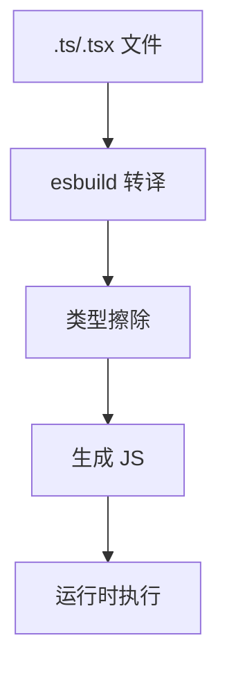

# 7. TypeScript 处理

> 📋 **本章内容：**
> - 使用 esbuild 转译 TS（快！）
> - 类型检查 vs 转译分离
> - TS 路径别名解析
> - 类型声明生成（库模式）

---

## 7.1 TypeScript 支持

### 7.1.1 开箱即用的 TS 支持

Vite 原生支持 TypeScript，无需额外配置：

```bash
# 创建 Vite + React + TS 项目
npm create vite@latest my-app -- --template react-ts
```

### 7.1.2 TypeScript 配置

```json
{
  "compilerOptions": {
    "target": "ES2020",
    "useDefineForClassFields": true,
    "lib": ["ES2020", "DOM", "DOM.Iterable"],
    "module": "ESNext",
    "skipLibCheck": true,
    "moduleResolution": "bundler",
    "allowImportingTsExtensions": true,
    "resolveJsonModule": true,
    "isolatedModules": true,
    "noEmit": true,
    "jsx": "react-jsx",
    "strict": true,
    "baseUrl": ".",
    "paths": {
      "@/*": ["src/*"]
    }
  },
  "include": ["src"]
}
```

---

## 7.2 使用 esbuild 转译 TS

### 7.2.1 为什么 esbuild 快？

| 特性 | 说明 |
|------|------|
| **Go 语言编写** | 比 JS 工具快 10-100 倍 |
| **类型擦除** | 不做类型检查，只做转译 |
| **并行处理** | 多线程处理 |

### 7.2.2 TypeScript 编译流程



### 7.2.3 类型擦除示例

```typescript
// TypeScript
const message: string = "Hello";
function greet(name: string): void {
  console.log(`Hello ${name}`);
}
```

```javascript
// 转译后 JavaScript
const message = "Hello";
function greet(name) {
  console.log(`Hello ${name}`);
}
```

---

## 7.3 类型检查 vs 转译分离

### 7.3.1 Vite 的分离策略

| 功能 | 工具 | 时机 |
|------|------|------|
| 转译 | esbuild | 开发时，每次保存 |
| 类型检查 | tsc | 单独运行（如 `npm run build` 前） |

### 7.3.2 为什么分离？

**原因 1：性能**
- 类型检查慢
- 开发时不需要类型检查

**原因 2：职责分离**
- esbuild 专注速度
- tsc 专注类型检查

### 7.3.3 类型检查脚本

```json
{
  "scripts": {
    "dev": "vite",
    "build": "tsc && vite build",
    "preview": "vite preview",
    "type-check": "tsc --noEmit"
  }
}
```

---

## 7.4 TS 路径别名解析

### 7.4.1 配置路径别名

```json
{
  "compilerOptions": {
    "baseUrl": ".",
    "paths": {
      "@/*": ["src/*"],
      "@components/*": ["src/components/*"],
      "@utils/*": ["src/utils/*"]
    }
  }
}
```

### 7.4.2 Vite 配置路径别名

```typescript
// vite.config.ts
import { defineConfig } from 'vite';
import path from 'path';

export default defineConfig({
  resolve: {
    alias: {
      '@': path.resolve(__dirname, './src'),
      '@components': path.resolve(__dirname, './src/components'),
      '@utils': path.resolve(__dirname, './src/utils'),
    },
  },
});
```

### 7.4.3 使用路径别名

```typescript
import Button from '@components/Button';
import { formatDate } from '@utils/date';
import App from '@/App';
```

---

## 7.5 类型声明生成（库模式）

### 7.5.1 启用声明生成

```json
{
  "compilerOptions": {
    "declaration": true,
    "declarationMap": true,
    "emitDeclarationOnly": true,
    "outDir": "./dist/types"
  }
}
```

### 7.5.2 Vite 库模式配置

```typescript
// vite.config.ts
import { defineConfig } from 'vite';

export default defineConfig({
  build: {
    lib: {
      entry: './src/index.ts',
      name: 'MyLib',
      fileName: 'my-lib',
    },
  },
});
```

### 7.5.3 完整流程

```bash
# 1. 生成类型声明
tsc --emitDeclarationOnly --outDir dist/types

# 2. 构建库
npm run build
```

---

## 7.6 `tsconfig.json` 推荐配置

### 7.6.1 开发模式配置

```json
{
  "compilerOptions": {
    "target": "ES2020",
    "useDefineForClassFields": true,
    "lib": ["ES2020", "DOM", "DOM.Iterable"],
    "module": "ESNext",
    "skipLibCheck": true,
    "moduleResolution": "bundler",
    "allowImportingTsExtensions": true,
    "resolveJsonModule": true,
    "isolatedModules": true,
    "noEmit": true,
    "jsx": "react-jsx",
    "strict": true,
    "noUnusedLocals": true,
    "noUnusedParameters": true,
    "noFallthroughCasesInSwitch": true
  },
  "include": ["src"]
}
```

### 7.6.2 关键配置项

| 配置项 | 值 | 说明 |
|-------|---|------|
| `isolatedModules` | `true` | 每个文件单独编译，配合 esbuild |
| `noEmit` | `true` | tsc 不输出 JS（esbuild 处理） |
| `skipLibCheck` | `true` | 跳过类型库检查，加速 |

---

## 7.7 实验：观察 TypeScript 处理

### 实验 7.7.1：观察类型擦除

```typescript
// src/main.ts
const message: string = "Hello World";

function add(a: number, b: number): number {
  return a + b;
}
```

1. 启动 `npm run dev`
2. 查看浏览器中运行的代码

观察：
1. 类型注解是否被移除？
2. 代码是否正常运行？

### 实验 7.7.2：测试类型检查

1. 故意写一些类型错误
2. 运行 `npm run type-check`

观察：
1. 类型检查是否正常工作？
2. 开发服务器是否受到影响？

---

## 7.8 常见问题

### 问题 1：类型错误不影响开发服务器？

**原因：** Vite 使用 esbuild 转译，不做类型检查

**解决方法：**
```json
{
  "scripts": {
    "dev": "tsc --watch --noEmit & vite"
  }
}
```

### 问题 2：路径别名在 TypeScript 中报错？

**原因：** 只配置了 Vite，没配置 TypeScript

**解决方法：** 同时配置 `tsconfig.json` 的 `paths`

### 问题 3：如何生成类型声明文件？

**配置方法：**
```json
{
  "compilerOptions": {
    "declaration": true,
    "outDir": "./dist/types"
  }
}
```

---

## 7.9 总结

TypeScript 处理：

1. **esbuild 转译**：极快，但只做类型擦除
2. **分离策略**：类型检查和转译分离
3. **路径别名**：需要同时配置 TypeScript 和 Vite
4. **库模式**：支持生成类型声明

理解 TS 处理有助于更好地开发！

---

## 📚 下一章

接下来让我们深入了解 Vite 的插件系统架构：**[插件系统架构](./8. 插件系统架构.md)**
