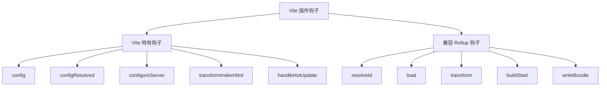
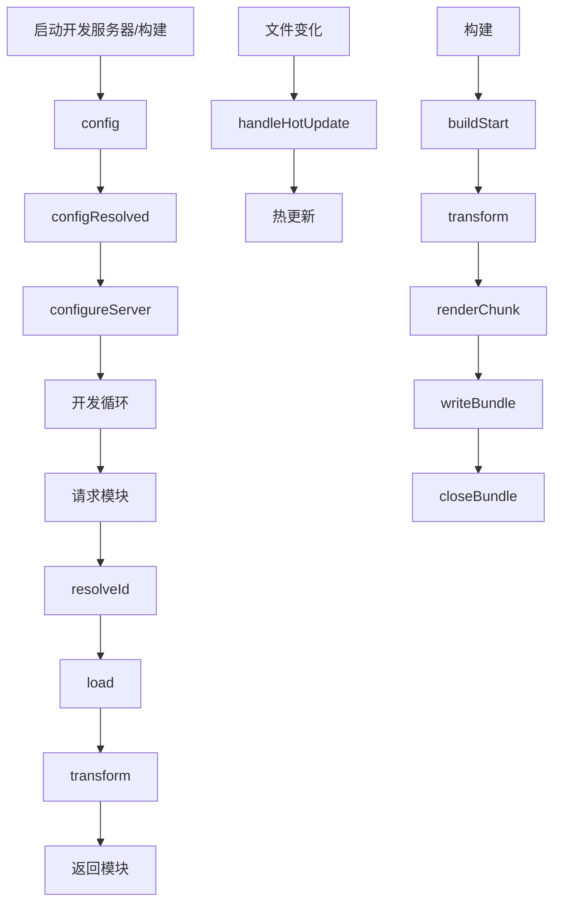

# 八、插件系统架构

> 📋 **本章内容：**
> - 插件钩子的底层实现
> - 插件执行顺序控制
> - Vite 插件 vs Rollup 插件的兼容性
> - 插件链控制

---

## 1. 插件架构概览

### 1.1 Vite 插件与 Rollup 插件

| 特性 | Vite 插件 | Rollup 插件 |
|------|----------|-----------|
| 钩子 | 兼容 Rollup 钩子 + Vite 特有钩子 | 只有 Rollup 钩子 |
| 用途 | 开发 + 构建 | 主要用于构建 |
| 兼容性 | 大部分 Rollup 插件可以直接用 | Vite 插件不能给 Rollup 用 |

### 1.2 插件钩子分类



---

## 2. 插件执行流程

### 2.1 完整流程



### 2.2 钩子执行顺序

```typescript
// 插件钩子按以下顺序执行
const order = [
  // 配置
  'config',
  'configResolved',
  
  // 开发服务器
  'configureServer',
  
  // 模块解析（每次请求）
  'resolveId',
  'load',
  'transform',
  
  // 热更新
  'handleHotUpdate',
  
  // 构建（仅生产环境）
  'buildStart',
  'renderStart',
  'renderChunk',
  'writeBundle',
  'buildEnd',
  'closeBundle',
  
  // HTML 转换
  'transformIndexHtml',
];
```

---

## 3. Vite 特有钩子

### 3.1 config - 修改配置

```typescript
export default {
  name: 'my-plugin',
  config(config, { command }) {
    if (command === 'build') {
      config.base = '/my-app/';
    }
    return config;
  },
};
```

### 3.2 configResolved - 获取最终配置

```typescript
export default {
  name: 'my-plugin',
  configResolved(config) {
    console.log('Final config:', config);
  },
};
```

### 3.3 configureServer - 配置开发服务器

```typescript
export default {
  name: 'my-plugin',
  configureServer(server) {
    // 添加中间件
    server.middlewares.use((req, res, next) => {
      console.log('Request:', req.url);
      next();
    });
    
    // 监听事件
    server.watcher.on('change', (file) => {
      console.log('File changed:', file);
    });
  },
};
```

### 3.4 transformIndexHtml - 转换 HTML

```typescript
export default {
  name: 'my-plugin',
  transformIndexHtml(html, { path }) {
    return html.replace(
      '</body>',
      '<script>console.log("Hello")</script></body>'
    );
  },
};
```

### 3.5 handleHotUpdate - 自定义热更新

```typescript
export default {
  name: 'my-plugin',
  handleHotUpdate({ file, modules, server }) {
    console.log('File changed:', file);
    
    // 自定义更新
    if (file.endsWith('.md')) {
      server.ws.send({
        type: 'custom',
        event: 'md-update',
        data: { file },
      });
      return [];
    }
  },
};
```

---

## 4. Rollup 钩子兼容性

### 4.1 支持的 Rollup 钩子

| 钩子 | 说明 |
|------|------|
| `resolveId` | 模块解析 |
| `load` | 模块加载 |
| `transform` | 模块转换 |
| `buildStart` | 构建开始 |
| `buildEnd` | 构建结束 |
| `writeBundle` | 写入 bundle |
| `closeBundle` | 关闭 bundle |
| `renderChunk` | 渲染 chunk |
| `renderStart` | 渲染开始 |

### 4.2 使用 Rollup 插件

```typescript
import { defineConfig } from 'vite';
import rollupPlugin from 'rollup-plugin-xxx';

export default defineConfig({
  plugins: [
    rollupPlugin(), // Rollup 插件可以直接用
  ],
});
```

### 4.3 Rollup 插件限制

| 特性 | 说明 |
|------|------|
| `output` 钩子 | 只在生产环境有效 |
| `renderDynamicImport` | 不支持 |
| `watchChange` | Vite 有 `handleHotUpdate` |

---

## 5. 插件执行顺序控制

### 5.1 插件顺序

```typescript
export default defineConfig({
  plugins: [
    // 先执行
    pluginA(),
    
    // 再执行
    pluginB(),
    
    // 最后执行
    pluginC(),
  ],
});
```

### 5.2 enforce 选项

```typescript
export default {
  name: 'my-plugin',
  enforce: 'pre', // 'pre' | 'post' | undefined
  config(config) {
    // ...
  },
};
```

| `enforce` 值 | 执行顺序 |
|--------------|---------|
| `pre` | 最前面 |
| 无 | 中间 |
| `post` | 最后面 |

### 5.3 order 选项（特定钩子）

```typescript
export default {
  name: 'my-plugin',
  configResolved: {
    order: 'pre',
    handler(config) {
      // ...
    },
  },
};
```

---

## 6. 插件链控制

### 6.1 同钩子的多个插件

```typescript
// 多个插件可以有相同的钩子
const plugin1 = {
  name: 'plugin1',
  resolveId(id) {
    if (id === 'module-a') {
      return '/path/to/module-a';
    }
  },
};

const plugin2 = {
  name: 'plugin2',
  resolveId(id) {
    if (id === 'module-b') {
      return '/path/to/module-b';
    }
  },
};

// 按顺序执行
// plugin1.resolveId 先执行
// 如无返回，plugin2.resolveId 再执行
```

### 6.2 钩子的异步/同步

```typescript
// 支持同步
{
  transform(code) {
    return code.toUpperCase();
  },
}

// 支持异步
{
  async transform(code) {
    const result = await someAsyncFn();
    return result;
  },
}
```

---

## 7. 实验：理解插件钩子

### 7.1 观察钩子执行顺序

```typescript
// vite.config.ts
import { defineConfig } from 'vite';

const loggerPlugin = {
  name: 'logger',
  config() {
    console.log('1. config');
  },
  configResolved() {
    console.log('2. configResolved');
  },
  configureServer() {
    console.log('3. configureServer');
  },
  transformIndexHtml(html) {
    console.log('4. transformIndexHtml');
    return html;
  },
  buildStart() {
    console.log('5. buildStart');
  },
};

export default defineConfig({
  plugins: [loggerPlugin],
});
```

运行 `npm run dev`，观察：
1. 钩子执行顺序？
2. 开发环境 vs 构建环境的不同？

### 7.2 测试 enforce

```typescript
const plugin1 = {
  name: 'plugin1',
  enforce: 'post',
  buildStart() {
    console.log('plugin1');
  },
};

const plugin2 = {
  name: 'plugin2',
  buildStart() {
    console.log('plugin2');
  },
};

const plugin3 = {
  name: 'plugin3',
  enforce: 'pre',
  buildStart() {
    console.log('plugin3');
  },
};
```

运行构建，观察顺序：
1. 是否是 plugin3 → plugin2 → plugin1？

---

## 8. 常见问题

### 问题 1：Rollup 插件在开发环境不工作？

**原因：** 某些 Rollup 钩子只在生产环境有效

**解决方法：** 检查钩子是否在开发环境支持

### 问题 2：钩子调用顺序不对？

**原因：** 没有正确配置 `enforce`

**解决方法：** 使用 `enforce: 'pre'` 或 `'post'`

### 问题 3：插件钩子返回了值，但没有被使用？

**原因：** 钩子链被提前返回了

**解决方法：** 检查是否有插件先返回了值

---

## 9. 总结

插件系统架构：

1. **Vite + Rollup**：Vite 插件兼容 Rollup 插件
2. **钩子顺序**：特定钩子按顺序执行
3. **执行控制**：通过 `enforce` 控制顺序
4. **钩子链**：多个插件可以有相同钩子

理解插件架构有助于开发更好的插件！

---

## 📚 下一章

接下来让我们深入了解 Vite 的生产构建：**[生产构建（Rollup）](./9. 生产构建.md)**
