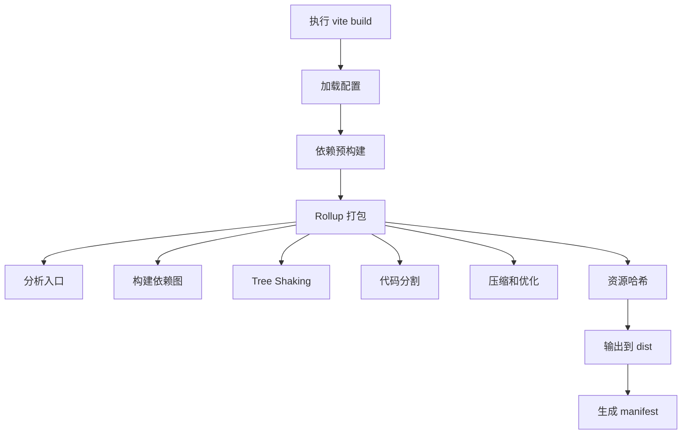

# 九、生产构建（Rollup）

> 📋 **本章内容：**
> - Rollup 集成
> - 代码分割策略
> - Tree Shaking 实现
> - 压缩和优化（terser/esbuild）
> - 资源预加载（Preload）
> - 构建产物分析

---

## 1. Vite 构建流程

### 1.1 完整构建流程



### 1.2 构建命令

```bash
# 标准构建
npm run build

# 构建时预览
npm run preview

# 自定义配置构建
vite build --mode production
```

---

## 2. Rollup 集成

### 2.1 配置 Rollup

```typescript
import { defineConfig } from 'vite';

export default defineConfig({
  build: {
    rollupOptions: {
      // Rollup 配置
      input: {
        main: './src/main.tsx',
        admin: './src/admin.tsx',
      },
      output: {
        manualChunks: {
          'vendor-react': ['react', 'react-dom'],
        },
      },
    },
  },
});
```

### 2.2 构建输出结构

```
dist/
├── assets/
│   ├── index.abc123.js
│   ├── index.abc123.css
│   └── logo.xyz789.png
├── index.html
└── manifest.json
```

---

## 3. Tree Shaking

### 3.1 Tree Shaking 原理

```typescript
// 模块 a
export function foo() {
  console.log('foo');
}
export function bar() {
  console.log('bar');
}

// 使用方
import { foo } from './a';
foo();
// bar() 没有被使用，会被 Tree Shaking 移除
```

### 3.2 配置 Tree Shaking

```typescript
export default defineConfig({
  build: {
    // 自动启用 Tree Shaking
    minify: 'terser', // 或 'esbuild'
  },
});
```

### 3.3 Tree Shaking 优化

```typescript
// vite.config.ts
export default defineConfig({
  build: {
    rollupOptions: {
      treeshake: {
        moduleSideEffects: 'no-external',
      },
    },
  },
});
```

---

## 4. 代码分割策略

### 4.1 自动代码分割

```typescript
// 动态导入自动分割
const module = await import('./large-module');
```

### 4.2 手动代码分割

```typescript
export default defineConfig({
  build: {
    rollupOptions: {
      output: {
        manualChunks: {
          'vendor-react': ['react', 'react-dom'],
          'vendor-utils': ['lodash', 'date-fns'],
          'ui-components': ['@mui/material', '@emotion/react'],
        },
      },
    },
  },
});
```

### 4.3 自定义分割函数

```typescript
export default defineConfig({
  build: {
    rollupOptions: {
      output: {
        manualChunks(id) {
          if (id.includes('node_modules')) {
            return 'vendor';
          }
          if (id.includes('src/utils')) {
            return 'utils';
          }
        },
      },
    },
  },
});
```

---

## 5. 压缩和优化

### 5.1 使用 terser

```typescript
export default defineConfig({
  build: {
    minify: 'terser', // 默认
    terserOptions: {
      compress: {
        drop_console: true, // 移除 console
        drop_debugger: true, // 移除 debugger
      },
    },
  },
});
```

### 5.2 使用 esbuild（更快）

```typescript
export default defineConfig({
  build: {
    minify: 'esbuild', // 更快
    target: 'es2020',
  },
});
```

### 5.3 禁用压缩

```typescript
export default defineConfig({
  build: {
    minify: false,
  },
});
```

---

## 6. 资源哈希

### 6.1 自动哈希

```typescript
export default defineConfig({
  build: {
    // 自动生成内容哈希
    assetsDir: 'assets',
  },
});
```

### 6.2 自定义哈希长度

```typescript
export default defineConfig({
  build: {
    rollupOptions: {
      output: {
        entryFileNames: 'assets/[name].[hash:8].js',
        chunkFileNames: 'assets/[name].[hash:8].js',
        assetFileNames: 'assets/[name].[hash:8].[ext]',
      },
    },
  },
});
```

---

## 7. Manifest 文件

### 7.1 Manifest 内容

```json
{
  "index.html": {
    "file": "index.html",
    "assets": ["assets/index.abc123.js", "assets/index.abc123.css"]
  },
  "src/main.tsx": {
    "file": "assets/index.abc123.js",
    "css": ["assets/index.abc123.css"]
  }
}
```

### 7.2 使用 Manifest

```typescript
export default defineConfig({
  build: {
    manifest: true, // 或 '.vite/manifest.json'
  },
});
```

---

## 8. 构建产物分析

### 8.1 启用 Bundle 分析

```typescript
// vite.config.ts
import { defineConfig } from 'vite';
import analyzer from 'rollup-plugin-visualizer';

export default defineConfig({
  plugins: [
    analyzer({
      filename: 'dist/stats.html',
    }),
  ],
});
```

### 8.2 查看分析

```bash
npm run build
# 打开 dist/stats.html 查看
```

---

## 9. 实验：理解生产构建

### 9.1 观察 Tree Shaking

```typescript
// src/utils.ts
export function used() {
  return 'used';
}
export function unused() {
  return 'unused';
}

// src/main.ts
import { used } from './utils';
console.log(used());
// unused() 没有被使用
```

运行构建，观察：
1. unused() 是否被移除？

### 9.2 观察代码分割

```typescript
// src/main.ts
import React from 'react';
import { heavyFunction } from './heavy-module';

const module = await import('./large-module');
```

运行构建，观察 `dist/assets`：
1. 是否有多个 chunk 文件？
2. react 是否在 vendor chunk 中？

### 9.3 观察资源哈希

1. 运行构建
2. 查看 `dist/assets` 中的文件名
3. 修改源码，再次构建
4. 观察哈希是否变化

---

## 10. 常见问题

### 问题 1：Tree Shaking 不工作？

**原因：** 使用 CommonJS 或有副作用

**解决方法：**
```typescript
// 确保使用 ES Modules
import { foo } from './module';

// package.json
{
  "type": "module"
}
```

### 问题 2：打包体积太大？

**解决方法：**
1. 分析 Bundle
2. 代码分割
3. 按需加载
4. 使用 CDN

### 问题 3：构建太慢？

**解决方法：**
1. 使用 `minify: 'esbuild'`
2. 减少依赖
3. 合理配置代码分割

---

## 11. 总结

生产构建：

1. **Rollup 集成**：Vite 使用 Rollup 进行生产构建
2. **Tree Shaking**：移除未使用代码
3. **代码分割**：优化加载性能
4. **压缩优化**：terser 或 esbuild
5. **资源哈希**：处理缓存

理解生产构建有助于优化项目！

---

## 📚 下一章

接下来让我们深入了解 Vite 的虚拟模块系统：**[虚拟模块系统](./10. 虚拟模块系统.md)**
