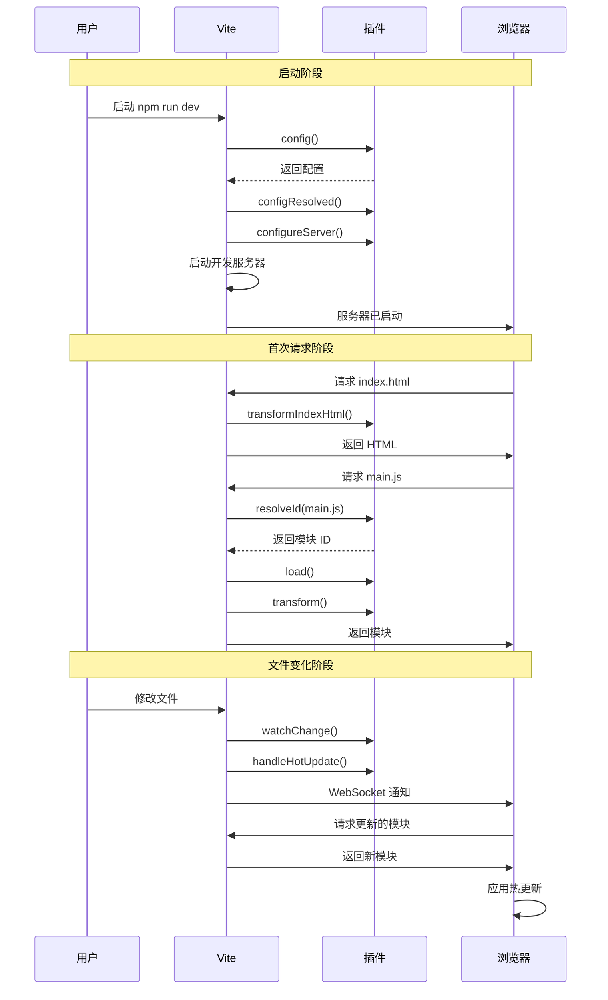
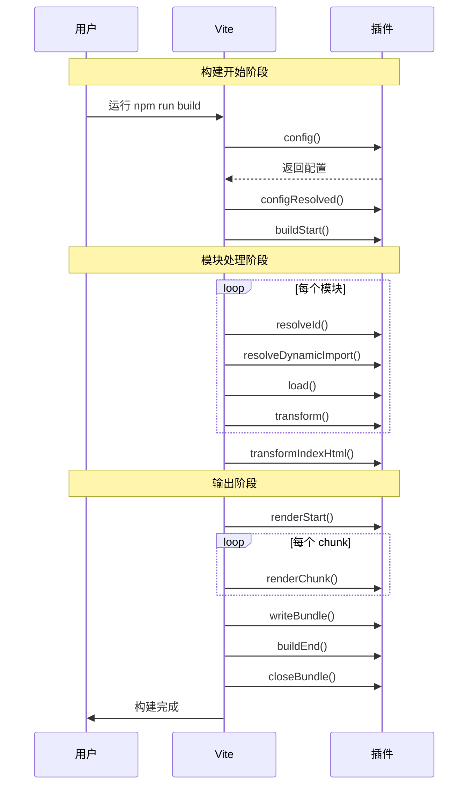
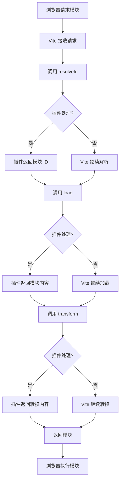
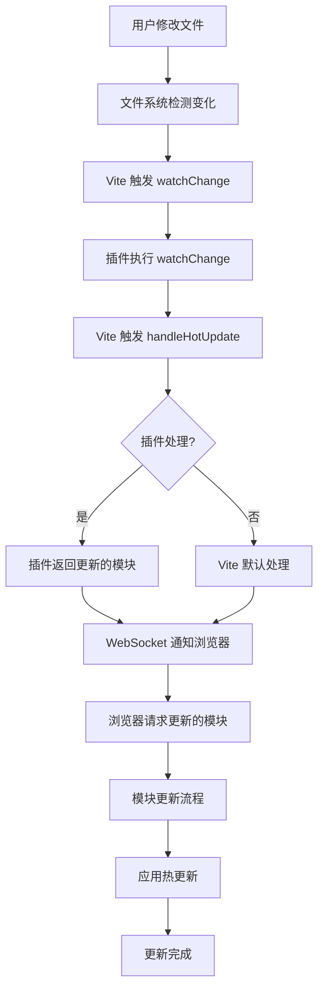

# 2. 基本结构和钩子机制

## 一、插件的基本结构

一个最简单的 Vite 插件结构如下：

```typescript
// my-plugin.ts
// 导出一个插件对象或函数
export function myPlugin() {
  return {
    // 插件名称（必填）
    name: 'my-plugin',
    
    // 钩子函数...
  }
}
```

在 vite.config.ts 中使用：

```typescript
import { defineConfig } from 'vite'
// 引入自定义插件
import { myPlugin } from './my-plugin'

export default defineConfig({
  plugins: [myPlugin()]
})
```

## 二、插件钩子机制

Vite 插件钩子分为以下几类：

### 2.1 配置钩子

#### config 钩子

**作用**：在解析配置之前修改 Vite 配置。

**类型**：同步或异步

**示例**：

```typescript
export function myPlugin() {
  return {
    name: 'my-plugin',
    
    // config 钩子
    config(config, env) {
      // 修改 Vite 配置
      return {
        define: {
          // 添加环境变量
          __MY_PLUGIN__: JSON.stringify('enabled')
        }
      }
    }
  }
}
```

**参数说明**：

- `config`：当前 Vite 配置对象
- `env`：环境信息对象
  - `command`：命令类型（'serve' 或 'build'）
  - `mode`：模式（'development' 或 'production'）

**实际应用场景**：

- **环境变量注入**：根据不同环境注入不同的环境变量
- **配置动态调整**：根据命令类型或模式调整构建配置
- **插件集成**：自动集成其他插件的配置
- **路径别名设置**：根据项目结构自动设置路径别名

#### configResolved 钩子

**作用**：在配置解析完成后执行，可读取最终配置。

**类型**：同步

**示例**：

```typescript
export function myPlugin() {
  return {
    name: 'my-plugin',
    
    // configResolved 钩子
    configResolved(resolvedConfig) {
      // 读取最终配置
      console.log('Final config:', resolvedConfig)
    }
  }
}
```

**参数说明**：

- `resolvedConfig`：最终的 Vite 配置对象

**实际应用场景**：

- **配置验证**：验证最终配置是否符合插件要求
- **资源路径确定**：根据最终配置确定资源路径
- **插件初始化**：使用最终配置初始化插件内部状态
- **日志输出**：根据配置输出调试信息

### 2.2 Vite 开发服务器钩子【仅开发环境有效】

#### configureServer 钩子

**作用**：配置开发服务器。

**类型**：同步

**示例**：

```typescript
export function myPlugin() {
  return {
    name: 'my-plugin',
    
    // configureServer 钩子
    configureServer(server) {
      // 添加自定义中间件
      server.middlewares.use('/api', (req, res) => {
        res.end('Hello from API!')
      })
    }
  }
}
```

**参数说明**：

- `server`：Vite 开发服务器实例

**实际应用场景**：

- **API 中间件**：添加自定义 API 路由和处理逻辑
- **Mock 数据**：提供开发环境的 Mock 数据服务
- **代理配置**：配置自定义代理规则
- **服务器事件监听**：监听服务器启动、重启等事件
- **开发工具集成**：集成调试工具、性能分析工具

#### handleHotUpdate 钩子

**作用**：自定义热更新逻辑。

**类型**：异步

**示例**：

```typescript
export function myPlugin() {
  return {
    name: 'my-plugin',
    
    // handleHotUpdate 钩子
    handleHotUpdate(ctx) {
      // 处理热更新
      console.log('File changed:', ctx.file)
      return ctx.modules
    }
  }
}
```

**参数说明**：

- `ctx`：热更新上下文对象

**实际应用场景**：

- **自定义热更新逻辑**：对特定文件类型自定义热更新行为
- **资源清理**：当文件删除时清理相关资源
- **依赖分析**：分析文件变化影响的模块
- **性能优化**：减少不必要的热更新
- **开发工具集成**：在热更新时触发开发工具的操作

### 2.3 解析钩子

#### resolveId 钩子

**作用**：自定义模块解析逻辑。

**类型**：异步或同步

**示例**：

```typescript
export function myPlugin() {
  return {
    name: 'my-plugin',
    
    // resolveId 钩子
    resolveId(source, importer) {
      // 拦截特定的模块导入
      if (source === 'virtual-module') {
        // 返回模块 ID
        return '\0virtual-module'
      }
      return null
    }
  }
}
```

**参数说明**：

- `source`：模块导入的来源
- `importer`：导入者的文件路径

**实际应用场景**：

- **虚拟模块**：创建不存在于文件系统的虚拟模块
- **路径别名**：自定义模块解析路径
- **模块重定向**：将模块导入重定向到其他路径
- **依赖版本控制**：控制特定依赖的版本
- **文件系统隔离**：限制模块的访问范围

#### resolveId 与 resolveDynamicImport 的区别与联系

| 特性       | resolveId               | resolveDynamicImport |
| -------- | ----------------------- | -------------------- |
| **处理对象** | 所有模块导入（静态 + 动态）         | 仅动态导入（import()）      |
| **执行时机** | 模块解析阶段                  | 动态导入执行时              |
| **主要用途** | 自定义模块解析规则、创建虚拟模块        | 优化动态导入路径、条件导入        |
| **返回值**  | 模块 ID 字符串               | 包含 id 的对象            |
| **适用场景** | 静态导入、虚拟模块、路径别名          | 动态导入优化、代码分割、条件加载     |
| **执行顺序** | 先于 resolveDynamicImport | 后于 resolveId         |

#### resolveDynamicImport 钩子

**作用**：处理动态导入。

**类型**：异步

**示例**：

```typescript
export function myPlugin() {
  return {
    name: 'my-plugin',
    
    // resolveDynamicImport 钩子
    resolveDynamicImport(specifier) {
      if (specifier === './lazy') {
        return { id: './lazy.js' }
      }
      return null
    }
  }
}
```

**参数说明**：

- `specifier`：动态导入的路径

**实际应用场景**：

- **动态导入优化**：优化动态导入的路径解析
- **代码分割策略**：根据条件调整代码分割策略
- **环境特定导入**：根据环境动态选择导入路径
- **模块懒加载**：实现更灵活的模块懒加载逻辑
- **路由动态加载**：配合前端路由实现组件的动态加载

### 2.4 加载钩子

#### load 钩子

**作用**：自定义模块加载逻辑。

**类型**：异步或同步

**示例**：

```typescript
export function myPlugin() {
  return {
    name: 'my-plugin',
    
    // load 钩子
    load(id) {
      // 加载虚拟模块
      if (id === '\0virtual-module') {
        // 返回模块代码
        return 'export const message = "Hello from virtual module!"'
      }
      return null
    }
  }
}
```

**参数说明**：

- `id`：模块 ID

**实际应用场景**：

- **虚拟模块实现**：加载虚拟模块的内容
- **自定义文件格式**：加载和处理自定义文件格式
- **代码生成**：根据模块 ID 生成代码
- **资源内联**：将资源文件内联为模块
- **依赖注入**：在模块加载时注入依赖

### 2.5 转换钩子

#### transform 钩子

**作用**：转换已加载的模块代码。

**类型**：异步或同步

**示例**：

```typescript
export function myPlugin() {
  return {
    name: 'my-plugin',
    
    // transform 钩子
    transform(code, id) {
      // 只处理 .js 文件
      if (id.endsWith('.js')) {
        // 在代码开头添加注释
        return {
          code: `// Processed by my-plugin\n${code}`,
          map: null
        }
      }
      return null
    }
  }
}
```

**参数说明**：

- `code`：模块源代码
- `id`：模块 ID

**实际应用场景**：

- **代码转换**：将 TypeScript、JSX 等转换为 JavaScript
- **代码注入**：注入版权信息、调试代码等
- **代码优化**：优化代码结构、移除未使用的代码
- **依赖分析**：分析模块依赖关系
- **环境变量替换**：替换代码中的环境变量
- **性能监控**：注入性能监控代码

#### transformIndexHtml 钩子

**作用**：转换 HTML 入口文件。

**类型**：异步

**示例**：

```typescript
export function myPlugin() {
  return {
    name: 'my-plugin',
    
    // transformIndexHtml 钩子
    transformIndexHtml(html) {
      // 在 HTML 中添加 meta 标签
      return html.replace('</head>', '<meta name="description" content="My app">\n</head>')
    }
  }
}
```

**参数说明**：

- `html`：HTML 内容

**实际应用场景**：

- **元信息注入**：注入 meta 标签、title 等
- **脚本注入**：注入分析脚本、统计代码等
- **样式注入**：注入全局样式、主题样式等
- **环境变量注入**：根据环境注入不同的配置
- **资源路径处理**：动态调整资源路径
- **PWA 支持**：注入 PWA 相关配置

### 2.6 构建钩子

#### buildStart 钩子

**作用**：构建开始时执行。

**类型**：异步

**示例**：

```typescript
export function myPlugin() {
  return {
    name: 'my-plugin',
    
    // buildStart 钩子
    buildStart() {
      console.log('Build started!')
    }
  }
}
```

**实际应用场景**：

- **构建准备**：准备构建所需的资源和环境
- **依赖检查**：检查项目依赖是否完整
- **缓存清理**：清理旧的构建缓存
- **构建配置验证**：验证构建配置是否正确
- **资源预加载**：预加载构建所需的资源

#### renderStart 钩子

**作用**：渲染开始时执行。

**类型**：异步

**示例**：

```typescript
export function myPlugin() {
  return {
    name: 'my-plugin',
    
    // renderStart 钩子
    renderStart(outputOptions) {
      console.log('Render started!')
    }
  }
}
```

**实际应用场景**：

- **渲染准备**：准备渲染所需的资源
- **输出配置验证**：验证输出配置是否正确
- **性能监控**：开始记录构建性能数据
- **资源优化**：根据输出配置调整资源优化策略
- **构建模式检测**：根据构建模式调整渲染策略

#### renderChunk 钩子

**作用**：渲染 chunk 时执行。

**类型**：异步

**示例**：

```typescript
export function myPlugin() {
  return {
    name: 'my-plugin',
    
    // renderChunk 钩子
    renderChunk(code, chunk) {
      // 处理 chunk 代码
      if (chunk.name === 'main') {
        return { code: code + '\nconsole.log("Main chunk processed!")' }
      }
      return null
    }
  }
}
```

**参数说明**：

- `code`：chunk 代码
- `chunk`：chunk 信息

**实际应用场景**：

- **代码压缩**：自定义代码压缩逻辑
- **代码注入**：注入全局变量、版权信息等
- **代码分割优化**：优化代码分割策略
- **模块打包分析**：分析模块打包情况
- **性能优化**：优化 chunk 大小和加载顺序
- **热更新支持**：为 chunk 添加热更新支持

#### writeBundle 钩子

**作用**：写入 bundle 时执行。

**类型**：异步

**示例**：

```typescript
export function myPlugin() {
  return {
    name: 'my-plugin',
    
    // writeBundle 钩子
    writeBundle(options, bundle) {
      console.log('Bundle written!')
      console.log('Bundle size:', Object.keys(bundle).length)
    }
  }
}
```

**参数说明**：

- `options`：输出选项
- `bundle`：bundle 信息

**实际应用场景**：

- **构建产物分析**：分析构建产物的大小、依赖等
- **资源优化**：优化构建产物的性能
- **部署准备**：准备部署所需的文件和配置
- **构建报告**：生成构建报告和统计信息
- **资源上传**：将构建产物上传到 CDN 或其他存储
- **类型声明生成**：生成 TypeScript 类型声明文件

#### buildEnd 钩子

**作用**：构建结束时执行。

**类型**：异步

**示例**：

```typescript
export function myPlugin() {
  return {
    name: 'my-plugin',
    
    // buildEnd 钩子
    buildEnd(error) {
      if (error) {
        console.error('Build failed:', error)
      } else {
        console.log('Build completed successfully!')
      }
    }
  }
}
```

**参数说明**：

- `error`：构建错误（如果有）

**实际应用场景**：

- **构建结果处理**：根据构建结果执行不同的操作
- **错误处理**：处理构建过程中出现的错误
- **构建统计**：统计构建时间、产物大小等信息
- **通知机制**：发送构建完成通知
- **后续操作**：触发构建后的后续操作，如部署、测试等
- **缓存清理**：清理构建过程中产生的临时文件

#### closeBundle 钩子

**作用**：关闭 bundle 时执行。

**类型**：异步

**示例**：

```typescript
export function myPlugin() {
  return {
    name: 'my-plugin',
    
    // closeBundle 钩子
    closeBundle() {
      console.log('Bundle closed!')
    }
  }
}
```

**实际应用场景**：

- **资源清理**：清理构建过程中产生的临时资源
- **最终化操作**：执行构建的最终化操作
- **构建总结**：生成构建总结报告
- **缓存更新**：更新构建缓存
- **资源释放**：释放构建过程中占用的资源
- **构建完成通知**：发送构建完成的最终通知

### 2.7 其他钩子

#### watchChange 钩子

**作用**：文件变化时执行（开发模式）。

**类型**：同步

**示例**：

```typescript
export function myPlugin() {
  return {
    name: 'my-plugin',
    
    // watchChange 钩子
    watchChange(id, change) {
      console.log('File changed:', id)
    }
  }
}
```

**参数说明**：

- `id`：文件路径
- `change`：变化信息

**实际应用场景**：

- **文件变化监控**：监控特定文件的变化
- **资源重新生成**：当文件变化时重新生成相关资源
- **依赖分析**：分析文件变化对其他模块的影响
- **热更新优化**：优化热更新的性能
- **开发工具集成**：在文件变化时触发开发工具的操作
- **构建缓存清理**：当关键文件变化时清理构建缓存

## 三、钩子触发时机详解

Vite 插件钩子按以下顺序执行：

**开发模式：**

```
config → configResolved 

→ configureServer → watchChange 

→ resolveId → resolveDynamicImport → load → transform → transformIndexHtml 

→ handleHotUpdate
```

**构建模式：**

```
config → configResolved 

→ buildStart 

→ resolveId → resolveDynamicImport → load → transform → transformIndexHtml 

→ renderStart → renderChunk → writeBundle → buildEnd → closeBundle
```

### 3.1 各个钩子的触发时机

| 钩子                     | 触发时机                                                                 | 环境      | 详细说明                               |
| ---------------------- | -------------------------------------------------------------------- | ------- | ---------------------------------- |
| `config`               | 解析配置之前                                                              | 开发 + 构建 | - 每次启动 Vite 或构建时触发<br>- 在读取 vite.config.ts 之后，但在配置最终确定之前 |
| `configResolved`       | 配置解析完成后                                                             | 开发 + 构建 | - `config` 钩子执行完成之后<br>- 配置已经最终确定，可以读取完整的配置对象 |
| `configureServer`      | 开发服务器启动时                                                             | 仅开发     | - 开发服务器初始化完成时<br>- 在 `configResolved` 之后执行<br>- 可以配置中间件、监听服务器事件 |
| `watchChange`          | 检测到文件变化时                                                             | 仅开发     | - 文件被修改（修改内容）<br>- 文件被添加（新建文件）<br>- 文件被删除（移除文件）<br>- 任何文件系统变化都会触发 |
| `resolveId`            | 模块请求时                                                               | 开发 + 构建 | - 每次请求模块时触发<br>- 静态导入 `import { x } from './module'`<br>- 动态导入 `import('./module')` 也会触发，但先调用 `resolveDynamicImport`<br>- 预构建依赖也会触发 |
| `resolveDynamicImport` | 动态导入时                                                               | 开发 + 构建 | - 仅在遇到动态导入 `import('./module')` 时触发<br>- 在 `resolveId` 之前调用<br>- 仅处理动态导入的模块 |
| `load`                 | 模块加载时                                                               | 开发 + 构建 | - `resolveId` 确定模块 ID 之后<br>- 每个模块第一次被加载时触发<br>- 后续请求可能从缓存读取，不一定触发 |
| `transform`            | 模块转换时                                                               | 开发 + 构建 | - `load` 加载模块内容之后<br>- 每个模块都会经过转换<br>- 同一模块多次请求，可能会复用转换结果 |
| `transformIndexHtml`   | HTML 转换时                                                              | 开发 + 构建 | - 请求 index.html 时触发<br>- 构建时处理 HTML 入口文件<br>- 可以注入脚本、修改 HTML 内容 |
| `handleHotUpdate`      | 文件变化时                                                               | 仅开发     | - 文件被修改（修改内容后保存）<br>- 文件被添加（新建文件）<br>- 文件被删除（移除文件）<br>- 在 `watchChange` 之后执行<br>- 用于自定义热更新逻辑 |
| `buildStart`           | 构建开始时                                                               | 仅构建     | - 执行 `vite build` 时触发<br>- 在 `configResolved` 之后<br>- 开始模块处理之前 |
| `renderStart`          | 渲染开始时                                                               | 仅构建     | - 所有模块转换完成后<br>- 开始生成最终输出之前 |
| `renderChunk`          | 渲染 chunk 时                                                          | 仅构建     | - 每个 chunk 生成时触发<br>- 可以修改和优化 chunk 代码 |
| `writeBundle`          | 写入 bundle 时                                                         | 仅构建     | - 所有 chunk 渲染完成后<br>- 即将写入文件系统时触发<br>- 可以分析和修改最终输出 |
| `buildEnd`             | 构建结束时                                                               | 仅构建     | - `writeBundle` 执行完之后<br>- 构建成功或失败都触发<br>- 如果构建出错，会收到 error 参数 |
| `closeBundle`          | 关闭 bundle 时                                                         | 仅构建     | - 整个构建流程完全结束时<br>- `buildEnd` 之后执行<br>- 用于最终的清理和收尾工作 |

### 3.2 钩子触发条件详解

**开发环境触发条件：**

1. **启动阶段**（仅执行一次）：
   - `config`：启动 Vite 时立即执行，在配置解析之前
   - `configResolved`：配置解析完成后执行
   - `configureServer`：开发服务器准备就绪后执行

2. **请求阶段**（每次模块请求时）：
   - `resolveId`：每次请求模块时执行（包括刷新页面）
   - `resolveDynamicImport`：遇到动态导入 `import()` 时执行
   - `load`：每个模块第一次加载时执行
   - `transform`：每个模块需要转换时执行
   - `transformIndexHtml`：请求 index.html 时执行

3. **文件变化阶段**（每次文件变化）：
   - `watchChange`：任何文件变化都触发（修改、添加、删除）
   - `handleHotUpdate`：文件变化后准备热更新时执行

**构建环境触发条件：**

1. **构建开始阶段**（仅执行一次）：
   - `config`：构建开始时执行
   - `configResolved`：配置解析完成后执行
   - `buildStart`：开始模块处理前执行

2. **模块处理阶段**（每个模块都执行）：
   - `resolveId`：解析每个模块时
   - `resolveDynamicImport`：处理动态导入时
   - `load`：加载每个模块时
   - `transform`：转换每个模块时
   - `transformIndexHtml`：处理 HTML 入口时

3. **输出阶段**（按顺序执行一次）：
   - `renderStart`：开始渲染输出时
   - `renderChunk`：每个 chunk 生成时执行
   - `writeBundle`：准备写入文件时
   - `buildEnd`：构建流程结束时（成功或失败都执行）
   - `closeBundle`：整个构建完全结束时

### 3.3 钩子触发次数说明

| 钩子                     | 开发环境触发次数    | 构建环境触发次数 | 说明 |
| ---------------------- | ----------- | -------- | --- |
| `config`               | 1次（每次启动）| 1次（每次构建） | 仅在开始时执行 |
| `configResolved`       | 1次（每次启动）| 1次（每次构建） | 配置确定后执行 |
| `configureServer`      | 1次（每次启动）| 0次（不执行） | 仅开发环境 |
| `watchChange`          | N次（每次文件变化）| 0次（不执行） | 每个文件变化都触发 |
| `resolveId`            | N次（每个模块请求）| N次（每个模块） | 每个模块都会触发 |
| `resolveDynamicImport` | N次（每个动态导入）| N次（每个动态导入） | 仅动态导入触发 |
| `load`                 | N次（每个模块首次加载）| N次（每个模块） | 开发环境可能从缓存读取，不触发 |
| `transform`            | N次（每个模块转换）| N次（每个模块） | 每个模块都要转换 |
| `transformIndexHtml`   | N次（每次HTML请求）| 1次（构建时） | 开发环境每次请求都触发 |
| `handleHotUpdate`      | N次（每次文件变化）| 0次（不执行） | 仅开发环境热更新 |
| `buildStart`           | 0次（不执行）| 1次（每次构建） | 仅构建环境 |
| `renderStart`          | 0次（不执行）| 1次（每次构建） | 仅构建环境 |
| `renderChunk`          | 0次（不执行）| N次（每个chunk） | 仅构建环境 |
| `writeBundle`          | 0次（不执行）| 1次（每次构建） | 仅构建环境 |
| `buildEnd`             | 0次（不执行）| 1次（每次构建） | 仅构建环境 |
| `closeBundle`          | 0次（不执行）| 1次（每次构建） | 仅构建环境 |

### 3.4 实际开发中的触发示例

**开发环境的完整一次交互流程：**

```
1. npm run dev 启动
   ↓
2. config() 执行（1次）
   ↓
3. configResolved() 执行（1次）
   ↓
4. configureServer() 执行（1次）
   ↓
5. 浏览器访问 localhost:5173
   ↓
6. transformIndexHtml() 执行（1次）
   ↓
7. 浏览器请求 main.js
   ↓
8. resolveId('main.js') 执行
   ↓
9. load('main.js') 执行
   ↓
10. transform(code, 'main.js') 执行
   ↓
11. 浏览器执行代码
   ↓
12. 用户修改 App.jsx 并保存
   ↓
13. watchChange('App.jsx') 执行
   ↓
14. handleHotUpdate() 执行
   ↓
15. 热更新完成
```

**构建环境的完整流程：**

```
1. npm run build 开始
   ↓
2. config() 执行（1次）
   ↓
3. configResolved() 执行（1次）
   ↓
4. buildStart() 执行（1次）
   ↓
5. [循环处理每个模块]
   resolveId() 执行
   load() 执行
   transform() 执行
   ↓
6. transformIndexHtml() 执行（1次）
   ↓
7. renderStart() 执行（1次）
   ↓
8. [循环处理每个 chunk]
   renderChunk() 执行
   ↓
9. writeBundle() 执行（1次）
   ↓
10. buildEnd() 执行（1次）
   ↓
11. closeBundle() 执行（1次）
   ↓
12. 构建完成！
```

## 四、钩子执行流程图

### 4.1 开发模式完整流程



### 4.2 构建模式完整流程



### 4.3 模块请求流程（单次请求）



### 4.4 热更新完整流程



## 五、钩子执行顺序详解

### 5.1 启动阶段顺序

```
1. config()
   ↓
2. configResolved()
   ↓
3. configureServer()  [仅开发]
```

### 5.2 单次请求顺序

```
1. resolveId()
   ↓
2. resolveDynamicImport()
   ↓
3. load()
   ↓
4. transform()
   ↓
5. transformIndexHtml()  [HTML 请求]
```

### 5.3 文件变化顺序

```
1. watchChange()
   ↓
2. handleHotUpdate()
```

### 5.4 完整构建顺序

```
1. config()
   ↓
2. configResolved()
   ↓
3. buildStart()
   ↓
4. [模块处理循环]
   resolveId()
   resolveDynamicImport()
   load()
   transform()
   ↓
5. transformIndexHtml()
   ↓
6. renderStart()
   ↓
7. renderChunk()
   ↓
8. writeBundle()
   ↓
9. buildEnd()
   ↓
10. closeBundle()
```

## 六、钩子组合应用示例

### 6.1 一个完整的插件钩子组合

```typescript
export function fullPlugin() {
  return {
    name: 'full-plugin',
    
    // 1. 启动阶段
    config(config) {
      console.log('1. config')
      return config
    },
    
    configResolved(config) {
      console.log('2. configResolved')
    },
    
    configureServer(server) {
      console.log('3. configureServer')
    },
    
    // 2. 模块处理阶段
    resolveId(source) {
      console.log('4. resolveId:', source)
      return null
    },
    
    resolveDynamicImport(specifier) {
      console.log('5. resolveDynamicImport:', specifier)
      return null
    },
    
    load(id) {
      console.log('6. load:', id)
      return null
    },
    
    transform(code, id) {
      console.log('7. transform:', id)
      return null
    },
    
    transformIndexHtml(html) {
      console.log('8. transformIndexHtml')
      return html
    },
    
    // 3. 文件变化阶段
    watchChange(id) {
      console.log('9. watchChange:', id)
    },
    
    handleHotUpdate(ctx) {
      console.log('10. handleHotUpdate:', ctx.file)
      return ctx.modules
    },
    
    // 4. 构建阶段
    buildStart() {
      console.log('11. buildStart')
    },
    
    renderStart() {
      console.log('12. renderStart')
    },
    
    renderChunk(code) {
      console.log('13. renderChunk')
      return null
    },
    
    writeBundle() {
      console.log('14. writeBundle')
    },
    
    buildEnd() {
      console.log('15. buildEnd')
    },
    
    closeBundle() {
      console.log('16. closeBundle')
    }
  }
}
```

通过这个完整的插件，你可以在控制台看到所有钩子的执行顺序！
