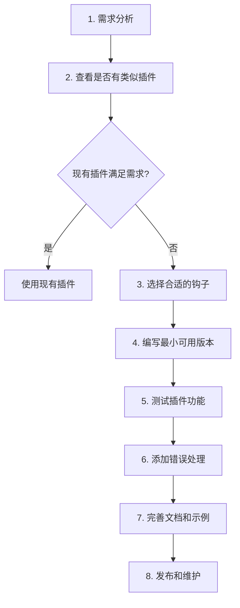
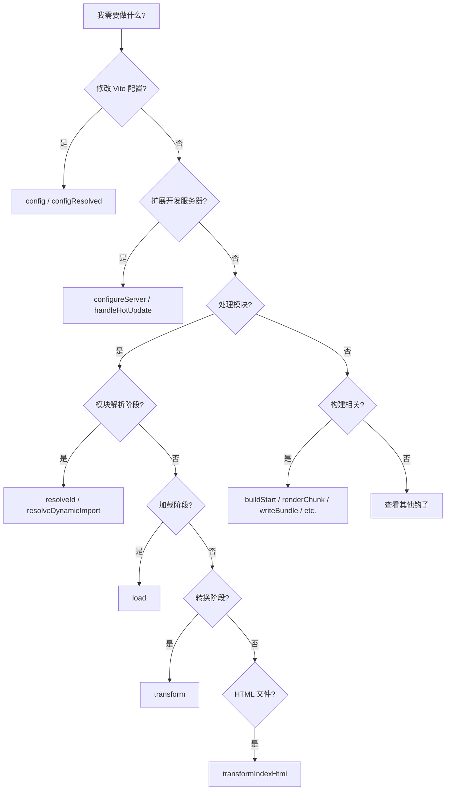

# 3. 插件开发思路

## 一、需求分析阶段

在开始编写插件之前，先明确插件的需求：

1. **明确插件的作用**
   - 是要扩展开发环境功能？
   - 还是要优化构建输出？
   - 或者需要处理特定的文件类型？

2. **确定适用的环境**
   - 仅开发环境使用？
   - 仅构建环境使用？
   - 还是开发+构建环境都需要？

3. **分析钩子选择**
   - 根据需求选择合适的钩子
   - 参考前文的钩子触发时机和作用

## 二、架构设计阶段

设计插件的整体架构：

1. **确定插件的核心功能**
   - 列出插件需要实现的功能点
   - 确定每个功能对应的钩子

2. **规划插件的配置选项**
   - 设计可配置的参数
   - 提供合理的默认值

3. **考虑错误处理策略**
   - 哪些情况需要抛出错误
   - 哪些情况可以优雅降级

## 三、开发流程建议

推荐的插件开发流程：



## 四、常见插件类型及实现思路

### 4.1 文件转换类插件

**适用场景**：支持自定义文件格式、编译模板等

**实现思路**：
```typescript
export function fileTransformPlugin() {
  return {
    name: 'vite-plugin-transform',
    
    // 使用 transform 钩子
    transform(code, id) {
      // 1. 通过扩展名过滤文件
      if (!id.endsWith('.ext')) {
        return null
      }
      
      // 2. 转换文件内容
      const result = transformCode(code)
      
      // 3. 返回转换后的代码
      return {
        code: result,
        map: null
      }
    }
  }
}
```

**关键钩子**：`transform`

### 4.2 虚拟模块类插件

**适用场景**：提供动态生成的模块、数据注入等

**实现思路**：
```typescript
export function virtualModulePlugin() {
  return {
    name: 'vite-plugin-virtual',
    
    // 1. resolveId 钩子：拦截虚拟模块
    resolveId(source) {
      if (source === 'virtual:config') {
        // 使用 \0 前缀避免冲突
        return '\0virtual:config'
      }
      return null
    },
    
    // 2. load 钩子：加载虚拟模块内容
    load(id) {
      if (id === '\0virtual:config') {
        return `export default {
          title: 'My App',
          version: '1.0.0'
        }`
      }
      return null
    }
  }
}
```

**关键钩子**：`resolveId`、`load`

### 4.3 HTML 处理类插件

**适用场景**：动态修改 index.html、注入脚本等

**实现思路**：
```typescript
export function htmlPlugin() {
  return {
    name: 'vite-plugin-html',
    
    // 使用 transformIndexHtml 钩子
    transformIndexHtml(html, { path }) {
      // 1. 解析 HTML
      // 2. 修改内容（注入脚本、添加 meta 标签等）
      // 3. 返回修改后的 HTML
      return html.replace(
        '</head>',
        '<script src="/custom-script.js"></script>\n</head>'
      )
    }
  }
}
```

**关键钩子**：`transformIndexHtml`

### 4.4 开发服务器扩展类插件

**适用场景**：添加自定义 API、Mock 数据、代理等

**实现思路**：
```typescript
export function serverPlugin() {
  return {
    name: 'vite-plugin-server',
    
    // 使用 configureServer 钩子
    configureServer(server) {
      // 添加自定义中间件
      server.middlewares.use('/api/mock', (req, res) => {
        res.end(JSON.stringify({ data: 'mocked' }))
      })
      
      // 监听服务器事件
      server.watcher.on('change', (file) => {
        console.log('File changed:', file)
      })
    }
  }
}
```

**关键钩子**：`configureServer`、`handleHotUpdate`

### 4.5 构建优化类插件

**适用场景**：构建产物优化、资源压缩、统计分析等

**实现思路**：
```typescript
export function buildPlugin() {
  return {
    name: 'vite-plugin-build',
    
    // 使用构建相关钩子
    buildStart() {
      console.log('Build started!')
    },
    
    renderChunk(code, chunk) {
      // 优化 chunk
      return { code: optimizeCode(code) }
    },
    
    writeBundle(options, bundle) {
      // 分析 bundle、生成统计报告
      analyzeBundle(bundle)
    }
  }
}
```

**关键钩子**：`buildStart`、`renderChunk`、`writeBundle`

## 五、选择钩子的决策树

在选择使用哪个钩子时，可以参考以下决策树：



## 六、最小可用原则

开发插件时遵循"最小可用"原则：

1. **第一版本**
   - 只实现核心功能
   - 不追求完美配置
   - 快速验证思路

2. **迭代优化**
   - 根据使用反馈添加功能
   - 逐步完善错误处理
   - 优化性能问题

## 七、测试策略

插件的测试建议：

1. **测试不同环境**
   - 开发环境 (`npm run dev`)
   - 构建环境 (`npm run build`)
   - 预览环境 (`npm run preview`)

2. **测试边界情况**
   - 空文件
   - 错误格式的输入
   - 特殊字符路径

3. **验证钩子触发次数**
   - 确保钩子不会被意外地重复执行
   - 验证缓存机制
